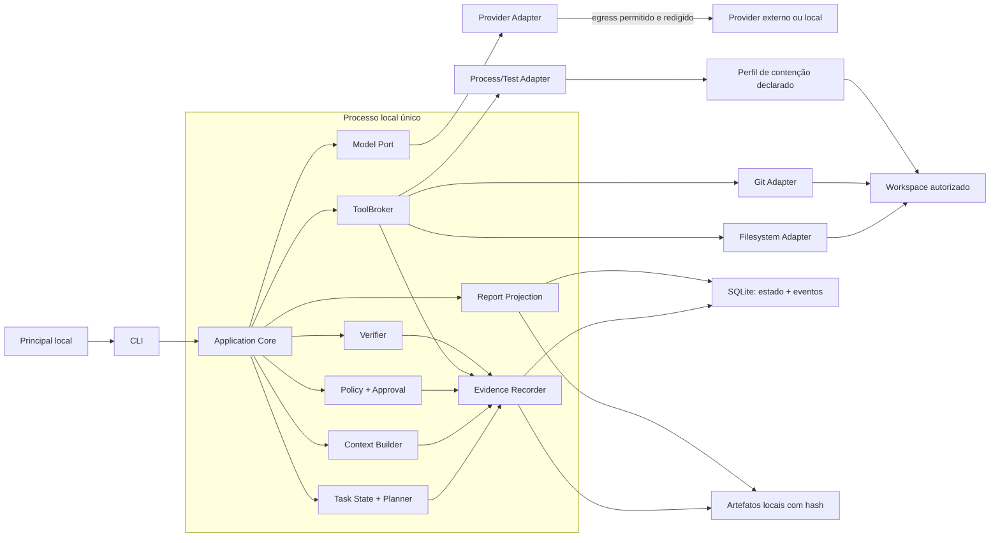
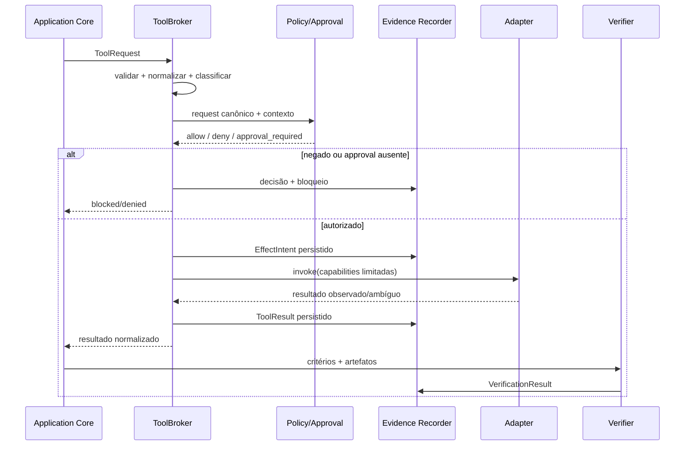
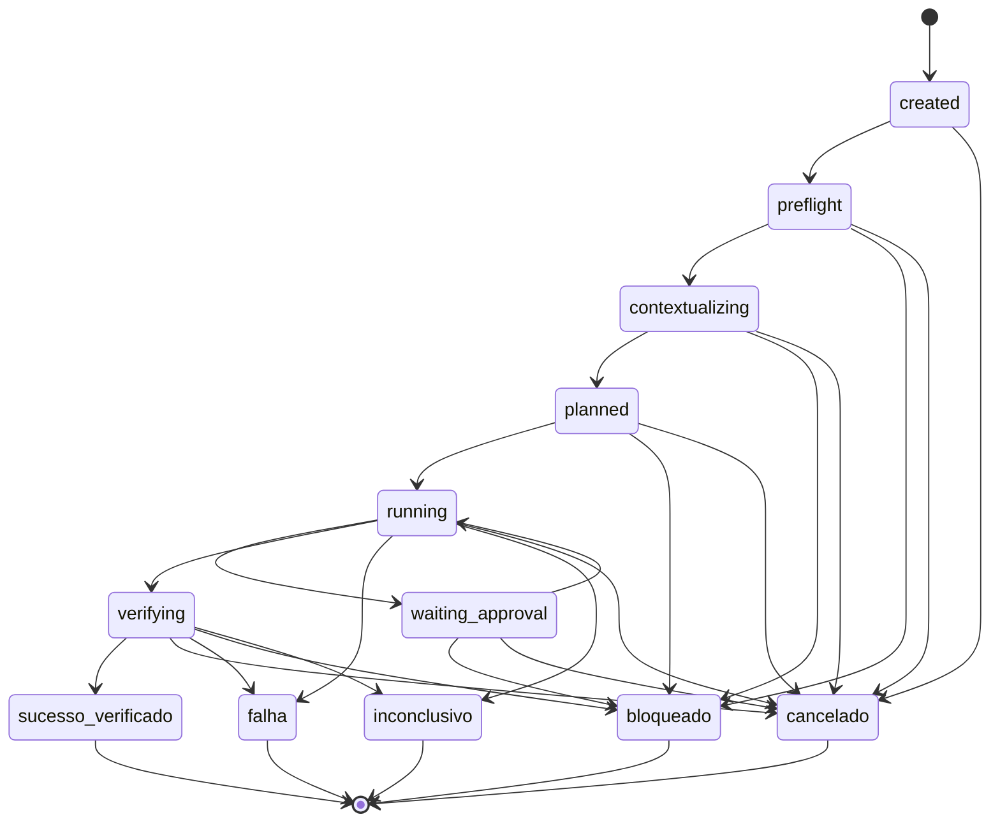

# Arquitetura de referência — P0 governado e verificável

**Estudo original:** 10 de agosto de 2026  
**Revisão:** 12 de agosto de 2026  
**Data de corte das fontes:** 12 de agosto de 2026  
**Versão:** 2.0  
**Status:** arquitetura-alvo documental; implementação e gates não auditados  
**Método:** [Protocolo de pesquisa rigorosa](../planejamento/protocolo_pesquisa_rigorosa.md)  
**Derivação:** [Visão](../produto/visao_do_produto.md), [casos de uso](../produto/casos_de_uso.md), [RF](../produto/requisitos_funcionais.md), [RNF](../produto/requisitos_nao_funcionais.md) e [segunda revisão dos temas](../planejamento/revisao_abordagens_temas_2026-08-12.md)

## 1. Resultado da revisão

A versão original listava 16 componentes e uma topologia distribuída antes de demonstrar necessidade: frontend/editor, API, subagentes, PostgreSQL, Redis, RAG vetorial, router, plugins/MCP, queue/workers e vários modos de implantação apareciam juntos no “MVP”. A recomendação ainda impunha Docker como sandbox e aprovação de plano inteira, embora isolamento real não tenha sido testado e aprovação genérica não autorize efeitos específicos.

A arquitetura revisada escolhe o menor sistema capaz de testar UC-01–05 e os invariantes `INV-01`–`INV-08`:

> **um processo local, um agente, uma tarefa mutante por workspace, uma porta de provider, uma porta obrigatória para todo efeito, uma máquina de estados explícita, SQLite como catálogo inicial e artefatos locais com hash.**

O P0 não contém listener de rede, fila distribuída, worker remoto, Redis, PostgreSQL, RAG vetorial, memória cross-task, routing automático, plugins, MCP, multiagentes, IDE própria ou marketplace. Esses itens permanecem alternativas P1/P2 condicionadas a gates, não extensões presumidas do core.

## 2. Pergunta, decisões e limites

### Pergunta

Qual é a arquitetura mínima que permite executar mudanças delimitadas em repositório autorizado, aplicar política antes de cada efeito, recuperar escritas e demonstrar o resultado sem criar infraestrutura que ainda não informa G1/G2 da visão?

### Decisões que este estudo informa

- fronteiras de módulos e direção de dependências;
- caminho único para efeitos e dados externos;
- modelo de estado, persistência e falha;
- trust boundaries e controles obrigatórios;
- componentes do P0 e gatilhos para P1/P2;
- ordem de implementação e testes arquiteturais.

### Premissas P0

- um principal identificado pelo host local;
- repositório existente e explicitamente autorizado;
- no máximo uma tarefa com escrita por workspace;
- um provider/modelo configurado; provider fake para contract tests;
- sem deploy, push, merge, migração ou alteração de infraestrutura produtiva;
- conteúdo do repositório, saída do modelo e saída das tools são não confiáveis;
- perfil de contenção é declarado por capacidade; isolamento forte continua desconhecido até PoC real.

### Fora de escopo

Operação 24×7, multi-tenant, SSO/RBAC organizacional, colaboração, cloud/híbrido, tarefas distribuídas, marketplace, billing, compliance formal e suporte simultâneo a três sistemas operacionais. A arquitetura mantém contratos que permitem reavaliação, mas não paga antecipadamente o custo dessas soluções.

## 3. Princípios e invariantes arquiteturais

| ID | Regra | Derivação |
|---|---|---|
| AR-I01 | Nenhum adapter de efeito é acessível pelo modelo ou CLI fora do `ToolBroker`. | INV-02, QG-01 |
| AR-I02 | Policy recebe request normalizado; texto do modelo não pode reduzir risco ou conceder capability. | INV-02/04, RNF-001 |
| AR-I03 | Escrita exige baseline/hash, intenção persistida, artefato reversível e verificação posterior. | INV-03, QG-04 |
| AR-I04 | Aprovação vincula ação, parâmetros, alvo, limite, principal, versão, expiração e nonce. | INV-04, RF-018 |
| AR-I05 | Secret é um handle resolvido no último momento; valor não entra em plano, evento, prompt ou relatório. | INV-06, QG-02 |
| AR-I06 | Efeito ambíguo não sofre retry automático e termina `inconclusivo` até reconciliação. | INV-07, QG-03 |
| AR-I07 | `sucesso_verificado` só é alcançável pelo `Verifier`, nunca pela resposta do modelo. | INV-05, RF-021 |
| AR-I08 | Cancelamento fecha a admissão de novas chamadas antes de tentar encerrar processos em voo. | INV-08 |
| AR-I09 | Falha de auditoria obrigatória bloqueia o próximo efeito; falha de telemetria opcional não altera decisão. | RNF-013 |
| AR-I10 | Módulos de domínio não importam SDK de provider, banco, shell, Git ou telemetria. | RNF-014/018 |

“Local” descreve implantação; não significa confiável. “Modular” descreve dependências; não implica processos separados. “Append-only” descreve a API de aplicação; não implica imutabilidade contra o operador.

## 4. Contexto e arquitetura P0

### Regra de topologia

A CLI chama uma API de aplicação **in-process**. Não há porta HTTP aberta por padrão. `ToolBroker`, `Policy` e `Evidence Recorder` são separações lógicas dentro do mesmo processo; sua eficácia depende de testes de dependência e de não haver adapter exportado por caminho alternativo.

O provider tem um cliente de egress próprio. Processos de tool não herdam essa rede: egress da aplicação para o provider e egress de código executado são capabilities distintas.

## 5. Módulos e responsabilidades

| ID | Módulo | Responsabilidade | Não pode fazer |
|---|---|---|---|
| AR-M01 | CLI | receber objetivo, mostrar estado/evidência, colher aprovação | chamar adapter ou decidir policy |
| AR-M02 | Application Core | coordenar caso de uso e ordenar ports | conter SDK/SQL/shell específico |
| AR-M03 | Task State | validar transição, checkpoint e cancelamento | executar efeito |
| AR-M04 | Planner | validar plano estruturado e alteração material | conceder autorização |
| AR-M05 | Context Builder | coletar contexto mínimo com origem/hash e redigir antes do egress | buscar fora do root ou gravar “memória” como fato |
| AR-M06 | Model Port | contrato de request, stream, erro, cancelamento e usage | decidir sucesso ou executar tool diretamente |
| AR-M07 | Policy/Approval | retornar `allow`, `deny` ou `approval_required`; validar approval | confiar em classificação do modelo como autoridade |
| AR-M08 | ToolBroker | validar, normalizar, autorizar, registrar intenção, invocar e registrar resultado | aceitar tool não registrada ou bypassar policy |
| AR-M09 | Adapters | realizar filesystem, Git, processo e testes no perfil concedido | ampliar capability recebida |
| AR-M10 | Verifier | executar/interpretar critérios e produzir `pass/fail/blocked/inconclusive` | tratar texto do agente como prova executável |
| AR-M11 | Evidence Recorder | persistir evento canônico, correlação, hashes e uso | persistir secret ou alegar imutabilidade externa |
| AR-M12 | Report Projection | derivar timeline, plano, diff, verificações, custo e resíduos | alterar evento canônico ou estado de domínio |

### Direção de dependências

`CLI/adapters/storage/provider/telemetry → application ports → domain contracts`. Dependência na direção inversa é falha arquitetural. Types compartilhados devem ser contratos pequenos e versionados, não um pacote que importe toda a aplicação.

Os diretórios atualmente presentes em `packages/` são candidatos não auditados. Conforme a [meta-auditoria](../planejamento/auditoria_revisao_adversarial_2026-08-12.md), existência/cópia de pacote não prova que ele instala, compila, testa ou integra; nenhum deles é dependência assumida desta arquitetura.

## 6. Contratos mínimos

| Contrato | Campos essenciais | Regra de versão |
|---|---|---|
| `TaskManifest` | objetivo, root, escopo, critérios, budget, timeout, policy, provider | rejeitar versão/campo crítico desconhecido |
| `PlanStep` | ID, precondições, tool, efeito previsto, risco, critérios | mudança material gera novo fingerprint |
| `ToolDefinition` | ID/versão, schemas, classe de efeito, cancelabilidade, política padrão | não registrar definição incompleta |
| `ToolRequest` | execução/passo, argumentos normalizados, alvo, precondição, idempotency key quando válida | validar antes de policy |
| `PolicyDecision` | decisão, versão/fingerprint, razão e approval necessário | fail-closed em erro/desconhecido |
| `ApprovalGrant` | principal, request fingerprint, limites, expiração, nonce | uso único para efeito material |
| `EffectIntent` | request, decisão, approval, baseline e instante anterior à invocação | persistir antes do efeito |
| `ToolResult` | status, saída redigida, exit code, duração, hashes e efeito observado | ambíguo é estado próprio |
| `VerificationResult` | critério, método/versão, status, evidência | obrigatório para sucesso |
| `EventEnvelope` | event ID, schema, execução, sequência, timestamps, tipo, payload, hash/correlação | correção cria evento novo |

Schemas devem ser fixados a um dialect identificável. JSON Schema 2020-12 é a referência inicial ([S6]); adotar Zod, biblioteca similar ou geração de tipos é decisão de implementação, não requisito arquitetural.

## 7. Fluxo normativo da tarefa

### 7.1 Preflight

1. identificar principal pelo host e resolver root canônico;
2. validar `TaskManifest` e capabilities disponíveis;
3. capturar commit-base, estado dirty, hashes e configuração efetiva;
4. criar ponto de recuperação ou bloquear antes da primeira escrita;
5. persistir tarefa e snapshot antes da primeira chamada ao modelo.

### 7.2 Contexto e plano

1. coletar apenas arquivos/trechos autorizados, cada um com origem e versão;
2. executar detector/redação antes de persistência e egress;
3. chamar provider através de `Model Port`, registrando versão/usage ou `desconhecido`;
4. validar o plano por schema e por disponibilidade das tools;
5. mostrar plano; sua revisão não autoriza antecipadamente os efeitos dos passos.

### 7.3 Caminho único de efeito

Nenhuma transação local torna atômicos SQLite e um efeito no filesystem, processo ou serviço externo. Por isso, a arquitetura usa protocolo de intenção, precondição, observação posterior e reconciliação. Crash entre invocação e resultado gera efeito `desconhecido/inconclusivo`; não autoriza repetição automática.

### 7.4 Encerramento

- `sucesso_verificado`: todos os critérios obrigatórios passam e não existe efeito/resíduo desconhecido;
- `falha`: execução ou verificação falha de maneira determinada;
- `bloqueado`: falta capability, aprovação, dependência ou precondição;
- `cancelado`: admissão fechada e toda operação iniciada tem desfecho conhecido; efeito material desconhecido termina `inconclusivo`;
- `inconclusivo`: o sistema não consegue provar resultado/efeito.

Rollback é uma operação com evidência, não um sexto estado final. Falha em rollback deixa resíduo explícito e impede `sucesso_verificado`.

## 8. Máquina de estados

Os nomes persistidos usam os enums de RF-004: `sucesso_verificado`, `falha`, `bloqueado`, `cancelado` e `inconclusivo`. Estados não documentados e transição depois de estado final são rejeitados.

## 9. Dados, persistência e integridade

O contrato detalhado, inclusive publicação de artefatos, backup, exclusão e migrações, está no estudo de [dados e persistência v2](dados_e_persistencia.md).

### Escolha P0

- **SQLite:** catálogo de tarefas, snapshots de configuração, transições, decisões, intents, resultados e verificações;
- **artifact store local:** planos, patches, diffs, stdout/stderr truncados, relatórios e snapshots necessários, com path lógico, tamanho, media type e hash no catálogo;
- **Git/worktree/snapshot:** mecanismo de baseline e mudança recuperável, não fonte única da auditoria;
- **secret store do host/ambiente aprovado:** apenas handle no catálogo.

SQLite fornece transações ACID e serializa writers ([S7], [S8]). Isso combina com um writer lógico e uma tarefa mutante por workspace, mas não prova capacidade futura de equipe/serviço. `journal_mode` e `synchronous` afetam durabilidade e desempenho ([S9]); serão fixados somente após fault test documentado, sem assumir WAL por preferência.

### Modelo mínimo

| Entidade | Finalidade |
|---|---|
| `projects` | ID, root canônico e policy associada |
| `task_runs` | manifesto, estado atual e fingerprints |
| `task_events` | sequência canônica necessária ao replay de estado |
| `effect_journal` | request/decisão/precondição, observação, ambiguidade, duração e hashes |
| `approvals` | concessão vinculada e consumo/revogação |
| `verifications` | critério, método, status e evidência |
| `artifacts` | metadado/hash/localização; bytes ficam fora quando grandes |
| `usage_events` | reportado, estimado ou desconhecido |

Eventos são fonte para reconstrução da tarefa, mas esta decisão não obriga event sourcing para todo dado da aplicação. Estado materializado é projeção verificável. Hash chain, se usada, detecta certas alterações dentro do trust model declarado; não cria não repúdio sem âncora/chave independente.

## 10. Trust boundaries e fluxos de dados

| ID | Fronteira | Ameaça dominante | Controle P0 | Limite conhecido |
|---|---|---|---|---|
| TB-01 | usuário/CLI → aplicação | input ambíguo ou alvo errado | manifesto, root canônico, confirmação específica | host comprometido está fora do modelo atual |
| TB-02 | workspace → contexto/modelo | prompt injection, secret, conteúdo obsoleto | origem/hash, escopo, redação, conteúdo como dado não confiável | detector não prova ausência universal |
| TB-03 | aplicação → provider | exfiltração, custo, capability divergente | allowlist de endpoint, minimização, credential handle, adapter contract | política/retensão do provider exige estudo próprio |
| TB-04 | broker → processo/filesystem/Git | execução inesperada, traversal, efeito não reversível | policy, argv tipado, precondição, perfil de contenção, timeout | isolamento real por SO ainda pendente |
| TB-05 | aplicação → SQLite/artefatos | perda, adulteração, PII/secret | transação, hash, permissões do host, redaction e backup a definir | operador local pode alterar storage |
| TB-06 | tool → rede | exfiltração e supply chain | egress negado por padrão; destino explícito por capability | enforcement depende do perfil demonstrado |

O OWASP Agentic Top 10 destaca goal hijack, tool misuse, privilege abuse, supply chain e execução inesperada como classes relevantes ([S10]). A arquitetura responde com least agency e enforcement determinístico; não presume que prompt, classificação de risco ou revisão por outro LLM sejam controles de autorização.

## 11. Perfis de efeito, retry e recuperação

| Classe | Exemplo | Retry automático | Recuperação |
|---|---|---|---|
| leitura local versionada | ler arquivo/hash/status | permitido se precondição continua válida | repetir e comparar versão |
| cálculo puro | validar schema, gerar diff em memória | permitido | recomputar |
| chamada de modelo | gerar plano/patch | apenas por política de budget; nova saída é nova tentativa | preservar todas as tentativas |
| escrita local recuperável | aplicar patch com hash-base | não após resultado ambíguo | verificar bytes; rollback com precondição |
| processo/teste | executar comando permitido | somente se classificado sem efeito material e ambiente limpo | encerrar árvore; listar sobreviventes/resíduos |
| externo/destrutivo | push, deploy, delete amplo | proibido no P0 | bloquear; futuramente reconciliar por API/idempotency key |

Checkpoint guarda estado confirmado; não transforma processo arbitrário em retomável. O recovery P0 reconstrói e reconcilia, mas não continua trabalho automaticamente. Uma retomada P1 sempre revalida workspace, configuração, policy, approval, budget e efeitos pendentes. O contrato detalhado está em [tarefas longas e assíncronas v2](tarefas_longas_assincronas.md).

## 12. Alternativas avaliadas e decisões

| ID | Questão | Escolha P0 | Alternativa adiada | Gatilho de reconsideração |
|---|---|---|---|---|
| AR-D01 | topologia | monólito modular, um processo | microserviços/workers | isolamento operacional, cadence ou carga reproduzida |
| AR-D02 | persistência | SQLite + artefatos locais | PostgreSQL/Redis/object store | acesso remoto, contenção de writer ou durabilidade não atendida |
| AR-D03 | orquestração | máquina de estados própria pequena | LangGraph/Temporal/BullMQ | fault matrix mostra redução líquida de defeitos/complexidade |
| AR-D04 | agentes | single-agent | subagentes/multiagentes | comparação pareada supera baseline em classe de tarefa |
| AR-D05 | contexto | arquivos explícitos + busca lexical | LSP/AST/grafo/vetor | ablação melhora sucesso downstream e frescor |
| AR-D06 | provider | um adapter/modelo fixo | gateway/router/fallback | segundo adapter necessário e routing vence fora da amostra |
| AR-D07 | extensão | tools internas registradas | plugin SDK/MCP/marketplace | segunda integração prova repetição sem regressão |
| AR-D08 | interface | CLI + API in-process | HTTP/web/editor | G0–G2 e recorrência G3; falha de revisão medida |
| AR-D09 | contenção | perfil declarado por capability; input hostil bloqueado sem perfil forte | container/gVisor/microVM | PoC por SO demonstra segurança/compatibilidade/custo |
| AR-D10 | telemetria | evento canônico + métricas mínimas | pipeline OTel/SIEM | diagnóstico distribuído/operacional real |
| AR-D11 | concorrência | uma tarefa mutante por workspace | locks/merge concorrente | demanda e fixture provam benefício superior ao conflito |
| AR-D12 | aprovação | por efeito material normalizado | aprovação genérica do plano | nenhuma; plano nunca é capability |

Estas decisões são reversíveis por port/adapters, mas “possível substituir” não é aceito sem contract test. OpenTelemetry pode correlacionar traces e logs ([S11]); não substitui o evento canônico nem prova cobertura/auditoria.

## 13. Fatias de implementação e gates

| Ordem | Fatia | Capacidade | Gate para avançar |
|---:|---|---|---|
| 0 | Harness | schemas, provider/tool fakes, state table, SQLite temporário | contract tests reproduzíveis |
| 1 | Read-only | registrar projeto, contexto lexical, plano, relatório, sem escrita | nenhuma tool fora do broker; QG-01/02 no corpus |
| 2 | Patch recuperável | baseline dirty, patch com hash, diff, rollback | QG-03/04 em fault injection de filesystem |
| 3 | Processo/verificação | comando tipado, timeout/cancelamento, teste e estados finais | árvore de processo/resíduos observáveis; INV-05/08 |
| 4 | Recuperação | crash em todos os kill points, reconstrução/reconciliação e retomada bloqueada quando insegura | RNF-010/011/022 no perfil declarado |
| 5 | UC-01–05 | manifests e oráculos por caso | G1/G2 da visão; métricas `MP-P0` |

Uma fatia não usa package copiado apenas porque existe. Adoção exige manifesto válido, instalação limpa, typecheck/build, testes e vínculo aos contratos acima.

## 14. Testes arquiteturais obrigatórios

| ID | Propriedade | Teste |
|---|---|---|
| AR-T01 | dependências | analisador bloqueia import domain → adapter/SDK e ciclos proibidos |
| AR-T02 | caminho de efeito | CLI, execução, retry e retomada geram decision → intent → result; handler não é exportado externamente |
| AR-T03 | máquina de estados | tabela cobre toda transição válida/inválida e impede saída de estado final |
| AR-T04 | falha fechada | schema/policy/audit obrigatória indisponível gera bloqueio sem efeito |
| AR-T05 | crash consistency | kill antes/depois de intent/invoke/result/recovery produz estado determinável ou inconclusivo |
| AR-T06 | workspace | corpus de path/link/TOCTOU impede escape e sobrescrita concorrente |
| AR-T07 | segredo/egress | canários não aparecem em DB, artefato, prompt, erro, trace ou conexão não autorizada |
| AR-T08 | provider | fake cobre stream parcial, rate limit, timeout, cancelamento, usage presente/ausente |
| AR-T09 | verificação | resposta “passou” do modelo não muda critério sem evidência do verifier |
| AR-T10 | recuperação | rollback preserva alteração preexistente e lista resíduo não recuperável |

## 15. Questões abertas

| ID | Questão | Como decidir | Bloqueia |
|---|---|---|---|
| OD-AR-01 | linguagem/runtime do primeiro vertical slice | spike mínimo + capacidade da equipe + packages realmente compiláveis | implementação, não arquitetura lógica |
| OD-AR-02 | SO e perfil de contenção oficialmente suportados | `OD-RNF-02` e PoC real, não apenas validador lógico | fixture hostil e claim de sandbox |
| OD-AR-03 | configuração SQLite de durabilidade | fault test com `MP-P0`, crash/power-loss simulado quando possível | claim de durabilidade |
| OD-AR-04 | local do data root e política de backup/remoção | inventário de dados, UX e retenção | dados pessoais/reais |
| OD-AR-05 | commands de teste permitidos por ecossistema | manifests UC + threat model por runner | UC-01–05 em repos reais |
| OD-AR-06 | provider e tratamento de dados | matriz de provider, região, retenção e contrato | código sensível externo |
| OD-AR-07 | limiar para extrair processo/serviço | baseline de carga/manutenção | P1 remoto/distribuído |

Atualização de implementação em 13/08/2026: OD-AR-01 foi fechada provisoriamente pela [ADR-001](../../implementation/adr/ADR-001-runtime-p0.md) para o vertical slice, com Node 24.16.x, ESM e TypeScript apagável. A decisão continua reversível pelos testes e não altera as demais questões abertas.

## 16. Registro de evidências

| ID | Afirmação | Classe | Fonte | Contraponto/limite | Confiança | Decisão |
|---|---|---|---|---|---|---|
| AR-C01 | A arquitetura original incluía componentes P1/P2 sem derivação ou gate | fato observado | versão anterior deste arquivo | lista era conceitual, não implementação | Alta | reduzir P0 |
| AR-C02 | Um processo local é suficiente para testar os casos e invariantes documentados | decisão/inferência | [S1], [S2], [S3], [S4], [S5] | ainda não comprovado por vertical slice | Média | AR-D01 |
| AR-C03 | SQLite oferece transações ACID e serializa writers | fato técnico | [S7], [S8] | não cobre filesystem/API externa e pode limitar concorrência | Alta | AR-D02 + intent protocol |
| AR-C04 | Configuração de journal/sync altera durabilidade e desempenho | fato técnico | [S9] | resultado depende de FS/hardware | Alta | OD-AR-03 |
| AR-C05 | Tool misuse e execução inesperada são riscos materiais de sistemas agentic | taxonomia de risco | [S10] | taxonomia não mede a probabilidade deste produto | Média-alta | broker/policy obrigatórios |
| AR-C06 | OTel oferece correlação operacional, mas não define o evento de negócio | fato + inferência | [S11] | implementação pode projetar eventos em spans/logs | Alta | AR-D10 |
| AR-C07 | A PoC local validou apenas restrições lógicas, não isolamento real | fato observado | [S12] | ambiente de teste foi limitado | Alta | bloquear claim de sandbox |
| AR-C08 | A existência dos packages atuais não demonstra integração | fato de auditoria | [S13] | podem conter código reaproveitável após validação | Alta | não assumir dependências |

## 17. Fontes e busca

- **[S1]** [Visão do produto](../produto/visao_do_produto.md), revisão de 12/08/2026.
- **[S2]** [Casos de uso](../produto/casos_de_uso.md), revisão de 12/08/2026.
- **[S3]** [Requisitos funcionais](../produto/requisitos_funcionais.md), revisão de 12/08/2026.
- **[S4]** [Requisitos não funcionais](../produto/requisitos_nao_funcionais.md), revisão de 12/08/2026.
- **[S5]** [Segunda revisão das abordagens](../planejamento/revisao_abordagens_temas_2026-08-12.md), 12/08/2026.
- **[S6]** JSON Schema, *Specification 2020-12*, consultada em 12/08/2026: https://json-schema.org/specification
- **[S7]** SQLite, *SQLite Is Transactional*, consultado em 12/08/2026: https://www.sqlite.org/transactional.html
- **[S8]** SQLite, *Isolation in SQLite*, consultado em 12/08/2026: https://www.sqlite.org/isolation.html
- **[S9]** SQLite, *PRAGMA synchronous*, consultado em 12/08/2026: https://www.sqlite.org/pragma.html#pragma_synchronous
- **[S10]** OWASP, *Top 10 for Agentic Applications 2026*, publicado em 09/12/2025, consultado em 12/08/2026: https://genai.owasp.org/resource/owasp-top-10-for-agentic-applications-for-2026/
- **[S11]** OpenTelemetry, *Logging and trace correlation*, consultada em 12/08/2026: https://opentelemetry.io/docs/specs/otel/logs/
- **[S12]** [PoC de sandbox — resultados preliminares](../planejamento/poc_sandbox_resultados.md), 11/08/2026.
- **[S13]** [Meta-auditoria da revisão adversarial](../planejamento/auditoria_revisao_adversarial_2026-08-12.md), 12/08/2026.

**Busca executada em 12/08/2026:** documentação oficial de SQLite para atomicidade, isolamento, writers, journal e durabilidade; JSON Schema para contratos; OWASP para riscos agentic; OpenTelemetry para correlação. Foram usadas fontes internas para escopo e resultados locais. Frameworks específicos foram tratados como alternativas e não como evidência de necessidade.

## 18. Limitações, encerramento e mudança

Nenhum vertical slice foi compilado ou executado nesta revisão. `MP-P0`, linguagem, SO suportado, configuração de durabilidade e perfil de isolamento continuam abertos. O diagrama é uma arquitetura-alvo, não inventário do que existe. A revisão encerra por limite documental: módulos, fluxos, trust boundaries, falhas, alternativas, gates e testes estão definidos; as decisões reabrem quando um teste falhar ou um gate de produto mudar.

**Mudança de 12/08/2026:** removidos do P0 os componentes sem necessidade demonstrada; API tornou-se in-process; aprovação passou de plano genérico para efeito específico; SQLite foi limitado ao catálogo local; persistência passou a reconhecer a lacuna atômica com efeitos externos; sandbox virou perfil de capacidade não comprovado; estados finais foram alinhados aos RF; packages existentes deixaram de ser evidência de implementação.
