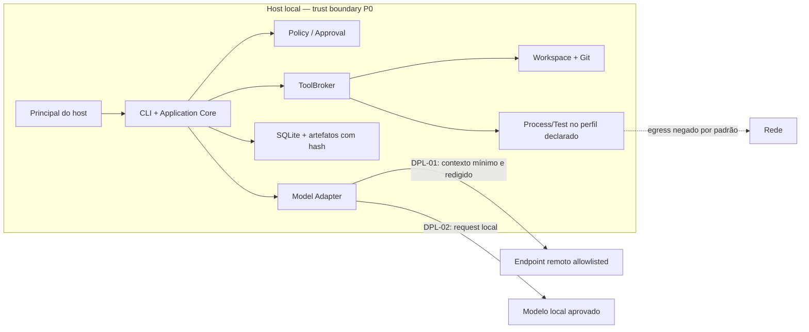

# Estratégia local, cloud e híbrida — perfis e gates

**Estudo original:** 10 de agosto de 2026  
**Revisão:** 12 de agosto de 2026  
**Data de corte das fontes:** 12 de agosto de 2026  
**Versão:** 2.0  
**Status:** estratégia documental; apenas o perfil local pertence ao P0; implantação não auditada  
**Método:** [Protocolo de pesquisa rigorosa](../planejamento/protocolo_pesquisa_rigorosa.md)  
**Base:** [Arquitetura de referência v2](arquitetura_de_referencia.md), [RF](../produto/requisitos_funcionais.md), [RNF](../produto/requisitos_nao_funcionais.md) e [visão do produto](../produto/visao_do_produto.md)

## 1. Resultado da revisão

A versão anterior atribuía notas subjetivas de custo, complexidade, segurança e maturidade a “local”, “cloud”, “híbrido”, “self-hosted”, “container”, “worker remoto” e “devcontainer”. Essas categorias não eram mutuamente exclusivas: container é runtime, self-hosted é responsabilidade operacional, worker é topologia e híbrido pode significar dezenas de combinações. “Local = privacidade alta” também escondia o envio de código a um LLM remoto.

Esta versão substitui rótulos por um **vetor de localização e responsabilidade**. Uma execução só pode ser chamada de local/cloud/híbrida depois de declarar onde ficam controle, workspace, tools, inferência, evidência, secrets e telemetria.

Decisão: o P0 mantém **controle, execução de tools, workspace e evidência no host local**. A inferência usa exatamente um endpoint declarado, local ou remoto. Se remoto, o perfil é “execução local com egress de modelo”, não “totalmente local”. Cloud, conector híbrido e self-hosted ficam condicionados a necessidade observada e aos gates G0–G3.

## 2. Perguntas e decisões

### Perguntas

1. Qual perfil testa UC-01–05 com menor trust boundary e custo operacional?
2. Que dado cruza cada fronteira e quem consegue lê-lo, alterá-lo ou retê-lo?
3. Que problema comprovado justificaria mover controle, execução ou storage para rede remota?
4. Quais contratos devem permanecer estáveis entre perfis sem prometer resultados idênticos?
5. Que falha ou custo torna cada migração inadequada?

### Não decisões

Este estudo não escolhe provedor de nuvem, região, LLM, container runtime, KMS, sistema de identidade ou base de dados remota. Também não conclui conformidade jurídica; localidade física é apenas uma das variáveis de privacidade, segurança e regulação.

## 3. Localidade é um vetor

| Dimensão | Valores que devem ser declarados | Pergunta de controle |
|---|---|---|
| interface/control plane | in-process local, processo local, serviço remoto | quem pode criar, cancelar e aprovar tarefas? |
| workspace/contexto | host, cópia efêmera remota, storage remoto | quais bytes deixam o repositório e por quanto tempo? |
| tool execution | host restrito, container/VM local, worker remoto | onde o efeito acontece e qual o blast radius? |
| inferência | modelo local, endpoint privado, SaaS externo | o que entra no prompt e qual política do destino? |
| estado/evidência | SQLite/artefato local, storage self-hosted, SaaS | quem altera, retém, exporta ou exclui? |
| secrets | host store, secret manager organizacional, credencial efêmera | quem resolve o handle e qual processo vê o valor? |
| telemetria | local/off, collector self-hosted, SaaS | logs/prompts/diffs cruzam fronteira? |
| identidade | usuário do host, identidade de dispositivo, OIDC/organização | como principal e dispositivo são autenticados/autorizados? |
| operação | usuário, equipe do cliente, fornecedor | quem aplica patch, backup, resposta e recuperação? |

NIST define cloud por acesso de rede sob demanda a um pool compartilhado e elástico de recursos, com modelos de serviço/implantação próprios ([S5]). Usar um modelo SaaS a partir de uma CLI local não transforma toda a aplicação em cloud, mas cria uma fronteira externa de dados que precisa ser nomeada.

## 4. Perfis de referência

| ID | Perfil | Controle/workspace/tools | Inferência | Estado/evidência | Fase e decisão |
|---|---|---|---|---|---|
| DPL-01 | local governado com inferência remota | local / local / local | endpoint externo allowlisted | local | P0 possível se política de dados permitir |
| DPL-02 | local integral/offline | local / local / local | modelo no host/rede local aprovada | local | alternativa P0; exige qualidade/hardware suficientes |
| DPL-03 | worker remoto isolado | controle local ou remoto / cópia autorizada / remoto | local ao worker ou externo | remoto | P1; somente se recurso/tarefa longa for problema observado |
| DPL-04 | híbrido com connector local | controle remoto / workspace local / tools locais | declarada por chamada | local + metadado remoto mínimo | P1/P2; maior risco de identidade, comando remoto e split-brain |
| DPL-05 | self-hosted organizacional | infraestrutura do cliente | local/privada/externa declarada | infraestrutura do cliente | P2 ou requisito de comprador; operação não é “grátis” |
| DPL-06 | SaaS multi-tenant | remoto / cópia remota / remoto | remoto | remoto multi-tenant | P2; exige isolamento, IAM, SLO e compliance próprios |

Somente um dos perfis DPL-01/DPL-02 precisa existir para o primeiro P0. Implementar ambos antes do baseline aumenta escopo sem validar a tese. A escolha depende de `OD-AR-06`: política de dados, capability, qualidade, custo e hardware.

## 5. Perfil P0

### Controles obrigatórios

- a CLI usa API in-process; nenhum listener de autenticação/rede por padrão;
- o relatório registra `deployment_profile_id` e a localização efetiva da inferência;
- processo/tool não herda a capability de rede do adapter de modelo;
- DPL-01 transmite somente contexto autorizado após redaction, pelo destino lógico registrado;
- DPL-02 não é chamado offline se atualização, telemetria ou outra integração ainda gerar egress;
- estado, planos, diffs e evidências permanecem no data root local definido;
- credencial do provider é resolvida no adapter e não entra no contexto/artefato;
- indisponibilidade do endpoint bloqueia/falha a tentativa; não muda silenciosamente de provider/modelo;
- package install, download ou acesso a serviço por tool é negado por padrão e requer capability própria;
- o host continua sendo parte do trust model: local não protege contra usuário/admin ou máquina comprometida.

## 6. Fluxos de dados e contrato de egress

Todo fluxo que cruza processo, host, rede, tenant ou operador DEVE ter um registro antes do piloto:

| Campo | Conteúdo |
|---|---|
| origem/destino | componente, operador, região/endereço lógico quando aplicável |
| dado | campos e formatos; não apenas “contexto” |
| finalidade | por que o destino precisa desses bytes |
| classificação | público, interno, confidencial, secret, dado pessoal ou `desconhecido` |
| transformação | seleção, redaction, truncamento, pseudonimização e criptografia |
| identidade/policy | principal, capability, decisão e approval quando exigido |
| retenção | storage intermediário/final, TTL, backup e caminho de exclusão |
| observabilidade | metadado permitido e conteúdo proibido em logs/traces |
| evidência | event/trace IDs, bytes enviados ou hash/manifesto reproduzível |
| revisão | responsável técnico e, quando aplicável, privacidade/jurídico |

### Classes P0

| Fluxo | DPL-01 | DPL-02 | Regra |
|---|---|---|---|
| objetivo/instruções → modelo | remoto | local | minimizar e registrar fingerprint |
| trechos do repositório → modelo | remoto após policy/redaction | local | origem/hash; secret-canário é gate |
| credencial → provider | somente adapter remoto | adapter local se necessária | valor nunca entra no prompt/evento |
| tool stdout/diff → modelo | remoto somente se necessário | local | truncar, redigir e marcar proveniência |
| eventos/relatórios → telemetria | local/off no P0 | local/off | exporter remoto é decisão separada |
| workspace → tool process | local | local | roots/capabilities e egress de processo separados |

LGPD e GDPR são fontes normativas relevantes quando houver dados pessoais ([S9], [S10]), mas esta matriz não decide papéis, base legal, transferência ou aplicabilidade. Qualquer uso real nessas condições exige inventário e revisão próprios; “dados ficaram locais” não é certificado de conformidade.

## 7. Comparação sem notas arbitrárias

| Perfil | Problema que pode resolver | Risco novo dominante | Custo operacional assumido por | Evidência mínima antes de adotar |
|---|---|---|---|---|
| DPL-01 | qualidade/capability de modelo sem operar inferência | exposição/retensão externa e indisponibilidade | usuário + provider | matriz de dados/provider, QG-02 e contract tests |
| DPL-02 | código não pode sair; operação offline | hardware, qualidade, patch/model supply chain | usuário/equipe local | benchmark de UC, recursos, atualização e egress zero observado |
| DPL-03 | laptop insuficiente ou tarefa longa | cópia do workspace, credencial e isolamento do worker | equipe do serviço | G0–G3, benchmark de recurso, threat model e recuperação |
| DPL-04 | controle remoto mantendo efeitos perto do código | comando remoto, confused deputy, reconexão/split-brain | duas pontas | autenticação de usuário/dispositivo, protocolo e fault matrix |
| DPL-05 | controle organizacional/contratual | drift, upgrade, backup e suporte no cliente | cliente + fornecedor conforme contrato | operação reproduzível, matriz de responsabilidade e upgrade/rollback |
| DPL-06 | colaboração, elasticidade e gestão central | isolamento tenant, blast radius e obrigação operacional | fornecedor + cliente | IAM, SLO, tenancy, DR, privacy/legal e piloto específico |

Cloud transfere parte da operação de infraestrutura, não a responsabilidade por dados, identidade, configuração e segurança da aplicação. Os modelos de responsabilidade da AWS e Azure explicitam que a divisão varia por serviço e preserva obrigações do cliente ([S7], [S8]); são exemplos de fornecedores, não prova de que um cloud específico serve ao projeto.

## 8. Identidade, autorização e confiança

Localização de rede não concede confiança implícita. A orientação Zero Trust do NIST desloca o foco de perímetro/localização para usuário, ativo e recurso, com autenticação/autorização explícitas ([S6]). Aplicação ao projeto:

| Perfil | Identidade mínima | Enforcement |
|---|---|---|
| DPL-01/02 | principal do host + projeto/workspace | policy in-process e permissões do host |
| DPL-03 | identidade de principal + job + worker + artifact | authorization no control plane e novamente no worker |
| DPL-04 | usuário, dispositivo/connector e sessão/tarefa | comando remoto vinculado; connector reavalia policy local |
| DPL-05/06 | OIDC/organização, serviço/workload e tenant | RBAC/capability, audience/issuer, isolamento e audit por tenant |

O control plane nunca envia “execute isto porque já autorizei” como texto. Ele envia request canônico e grant verificável; o execution plane revalida versão, escopo, alvo, expiração e nonce. Em híbrido, connector desconectado fecha a admissão de novos efeitos.

## 9. Portabilidade sem equivalência falsa

O contrato estável entre perfis inclui:

- `TaskManifest`, estados e transições finais;
- `ToolDefinition/Request/Result` e classe de efeito;
- policy decision/approval e principal;
- evidence/event envelope e artifact manifest;
- verification result e classes de usage/custo;
- regras de ambiguidade, cancelamento e reconciliação.

Não se exige igualdade byte a byte entre modelos, paths, timestamps, logs ou artefatos produzidos em ambientes diferentes. “Equivalência” significa passar a mesma contract suite e preservar semântica de segurança/estado. Política remota pode ser mais restritiva; nunca menos restritiva sem decisão explícita.

## 10. Falhas por perfil

| Falha | P0 local | Worker remoto | Híbrido connector |
|---|---|---|---|
| provider indisponível | tentativa falha/bloqueia; checkpoint local preservado | worker preserva estado; sem fallback silencioso | lado executor preserva estado confirmado |
| processo principal cai | SQLite/artefatos são reabertos e intents reconciliadas | control/worker depende do protocolo de lease | connector reabre apenas após reautenticação/revalidação |
| rede cai após request | chamada de modelo/custo pode ficar desconhecida | efeito remoto pode ficar inconclusivo | nenhum novo comando; efeito em voo reconciliado |
| control plane cai | não existe separado | worker não inicia efeito novo sem lease/grant válido | connector não interpreta ausência como autorização |
| storage fica indisponível | fail-closed antes do próximo efeito | fila/outbox e artifact store precisam contrato próprio | estado dividido bloqueia progressão |
| identidade/revogação muda | próxima tarefa/ação revalida host/policy | próxima operação protegida falha | connector recebe/consulta revogação dentro de limite declarado |

P1/P2 precisam definir RPO/RTO, lease, fencing, outbox, expiração e SLO com carga/janela. Esses mecanismos não pertencem ao P0 apenas porque serão necessários remotamente.

## 11. Gates de migração

| ID | Migração | Pré-condição necessária | Rejeitar/adiar se |
|---|---|---|---|
| GM-01 | DPL-01 → DPL-02 | política bloqueia egress ou benchmark local atende UC/qualidade/custo | hardware/qualidade impede sucesso e dado pode sair legalmente |
| GM-02 | local → worker remoto | G0–G3 + recurso/tarefa longa é causa observada de falha/abandono segundo o [gate de topologia](tarefas_longas_assincronas.md) | ganho só aparece em benchmark sintético ou exige trust boundary não aprovado |
| GM-03 | local → connector híbrido | usuário precisa controle remoto mantendo workspace local | protocolo aumenta efeitos ambíguos, latência ou falsa sensação de privacidade |
| GM-04 | SQLite local → storage remoto | colaboração/continuidade remota é requisito validado | motivação é apenas “escala futura” |
| GM-05 | single-user → multi-tenant | comprador/uso compartilhado e operação SaaS foram validados | isolamento/IAM/retention/SLO não têm owner e testes |
| GM-06 | managed → self-hosted | requisito contratual + capacidade de instalar, atualizar e suportar | custo por instalação e drift inviabilizam suporte |

G0–G2 validam problema, solução e segurança; G3 valida recorrência. Mesmo após esses gates, a migração precisa mostrar que **localidade** é a causa do problema, não UI, modelo, contexto, testes ou UX.

## 12. Experimentos

### EXP-LCH-01 — Perfil P0

Executar UC-01/02 em DPL-01 ou DPL-02, com fluxo de dados registrado. Medir:

- bytes/arquivos enviados por destino e classe;
- conexões observadas versus allowlist;
- secret-canário em prompt, storage, trace e relatório;
- sucesso verificado, latência, custo/usage e falhas;
- recuperação após interrupção do endpoint;
- processos/tools que tentaram egress.

### EXP-LCH-02 — Inferência local versus remota

Somente se ambos forem candidatos reais: mesma amostra, critérios, budget e perfil de tool. Comparar sucesso por caso, tempo, custo total de operação, consumo de CPU/RAM/GPU, dados que cruzam fronteira e manutenção. Resultado exploratório não vira claim de privacidade ou superioridade universal.

### EXP-LCH-03 — Worker/conector

Somente após GM-02/03: provider fake e fixture sem dados reais; injetar queda antes/depois de grant, intent, efeito e result. O candidato deve preservar QG-01–04, attribution e estados finais. Não usar sincronização feliz como único teste.

## 13. Decisões

| ID | Decisão vigente | Validade/gatilho |
|---|---|---|
| LCH-D01 | controle, workspace, tools e evidência locais no P0 | até GM-02/03/04 |
| LCH-D02 | um único local de inferência efetivo por execução, sempre registrado | multi-provider somente após avaliação P1 |
| LCH-D03 | DPL-01 não será descrito como “totalmente local” | permanente enquanto houver egress |
| LCH-D04 | DPL-02 não é requisito simultâneo do P0 | reabrir por política de dados ou benchmark |
| LCH-D05 | tool egress separado do model egress e negado por padrão | só exceção específica e auditada |
| LCH-D06 | cloud/híbrido não bloqueia G1/G2 | reabrir quando localidade causar falha observada |
| LCH-D07 | container/devcontainer não define perfil de implantação nem prova sandbox | depende da PoC de contenção |
| LCH-D08 | contratos preservam semântica, não resultado textual/bytes idênticos | permanente |
| LCH-D09 | self-hosted exige modelo de operação e responsabilidade próprio | antes de oferta/compromisso |
| LCH-D10 | multi-tenant exige arquitetura/testes próprios e não é flag de configuração | antes de compartilhar infraestrutura |

## 14. Questões abertas

| ID | Lacuna | Como fechar | Impacto |
|---|---|---|---|
| OD-LCH-01 | DPL-01 ou DPL-02 no primeiro vertical slice | `OD-AR-06` + benchmark/provider policy | adapter, hardware e egress |
| OD-LCH-02 | classes de código/dado autorizadas por destino | inventário + owner + revisão privacidade/jurídica | piloto com repositório real |
| OD-LCH-03 | data root, backup e exclusão local | RNF-024 + fault test | durabilidade/privacidade |
| OD-LCH-04 | necessidade real de tarefa assíncrona/remota | G3 e entrevistas/telemetria | GM-02/03 |
| OD-LCH-05 | regiões/fornecedores/serviços candidatos | somente após perfil requerido | responsabilidade, custo, transferência |
| OD-LCH-06 | capability de rede por SO/perfil | PoC real de contenção | claim de egress negado |

## 15. Registro de evidências

| ID | Afirmação | Classe | Fonte | Contraponto/limite | Confiança | Decisão |
|---|---|---|---|---|---|---|
| LCH-C01 | A tabela original misturava implantação, runtime e topologia | fato observado | versão anterior deste arquivo | era apenas comparação preliminar | Alta | usar vetor de localidade |
| LCH-C02 | P0 local informa G1/G2 com menor fronteira operacional atual | decisão/inferência | [S1], [S2], [S3], [S4] | inferência e supply chain ainda podem ser externas | Média-alta | LCH-D01 |
| LCH-C03 | Cloud é mais específico que “qualquer chamada remota” | fato normativo | [S5] | definição NIST é geral e de 2011 | Alta | separar egress de implantação |
| LCH-C04 | Localização de rede não concede confiança implícita | princípio normativo | [S6] | Zero Trust é referência geral, não arquitetura pronta | Alta | reautorização por recurso |
| LCH-C05 | Responsabilidade por dados/identidade/configuração não desaparece na cloud | fato declarado por fornecedores | [S7], [S8] | divisão exata varia por provider/serviço/contrato | Alta | matriz por perfil/serviço |
| LCH-C06 | “Local” não demonstra conformidade e “cloud” não demonstra não conformidade | inferência jurídica prudencial | [S9], [S10] | depende do tratamento, papéis, contrato e jurisdição; exige parecer | Alta | proibir claim automático |
| LCH-C07 | Worker/híbrido são necessários somente se localidade causar problema observado | decisão | [S2], [S3], [S4] | necessidade pode surgir no piloto | Média | gates GM-02/03 |

## 16. Fontes e busca

- **[S1]** [Arquitetura de referência v2](arquitetura_de_referencia.md), 12/08/2026.
- **[S2]** [Visão do produto](../produto/visao_do_produto.md), revisão de 12/08/2026.
- **[S3]** [Requisitos funcionais](../produto/requisitos_funcionais.md), revisão de 12/08/2026.
- **[S4]** [Requisitos não funcionais](../produto/requisitos_nao_funcionais.md), revisão de 12/08/2026.
- **[S5]** NIST, *SP 800-145 — The NIST Definition of Cloud Computing*, final de 09/2011, consultado em 12/08/2026: https://csrc.nist.gov/pubs/sp/800/145/final
- **[S6]** NIST, *SP 800-207 — Zero Trust Architecture*, final de 08/2020, consultado em 12/08/2026: https://csrc.nist.gov/pubs/sp/800/207/final
- **[S7]** AWS, *Shared Responsibility Model*, consultado em 12/08/2026: https://aws.amazon.com/compliance/shared-responsibility-model/
- **[S8]** Microsoft Azure, *Shared responsibility in the cloud*, consultado em 12/08/2026: https://learn.microsoft.com/en-us/azure/security/fundamentals/shared-responsibility
- **[S9]** Brasil, *Lei nº 13.709/2018 — LGPD, texto compilado*, consultada em 12/08/2026: https://www.planalto.gov.br/ccivil_03/_ato2015-2018/2018/lei/l13709compilado.htm
- **[S10]** União Europeia, *Regulamento (UE) 2016/679 — GDPR*, consultado em 12/08/2026: https://eur-lex.europa.eu/eli/reg/2016/679/oj

**Busca executada em 12/08/2026:** definição oficial de cloud, Zero Trust, responsabilidade compartilhada em dois fornecedores e textos oficiais LGPD/GDPR. Foram evitadas tabelas genéricas de “cloud versus local” sem workload. Fontes de fornecedor sustentam apenas a responsabilidade declarada no próprio serviço; não comparação de superioridade.

## 17. Limitações, encerramento e mudança

Nenhum perfil foi implantado nesta revisão. Não foram medidos hardware local, egress real, provider, região, custo operacional, latência de rede ou recuperação distribuída. A estratégia está concluída por limite documental quando perfis, fluxos, riscos, experimentos, gates e rejeições são explícitos; cada perfil só é validado depois do experimento correspondente.

**Mudança de 12/08/2026:** removidas notas subjetivas de 1–5 e a recomendação automática de Docker/devcontainer; localidade passou a vetor; inferência remota deixou de ser escondida pelo rótulo local; cloud/híbrido/self-hosted foram movidos para gates; equivalência passou de artefato idêntico para contrato semântico; identidade e responsabilidade foram explicitadas por perfil.
