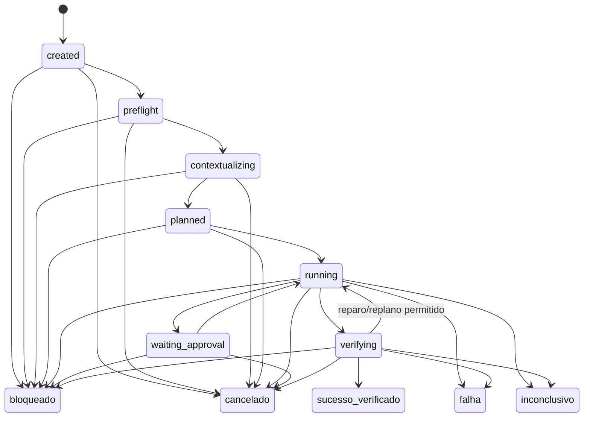
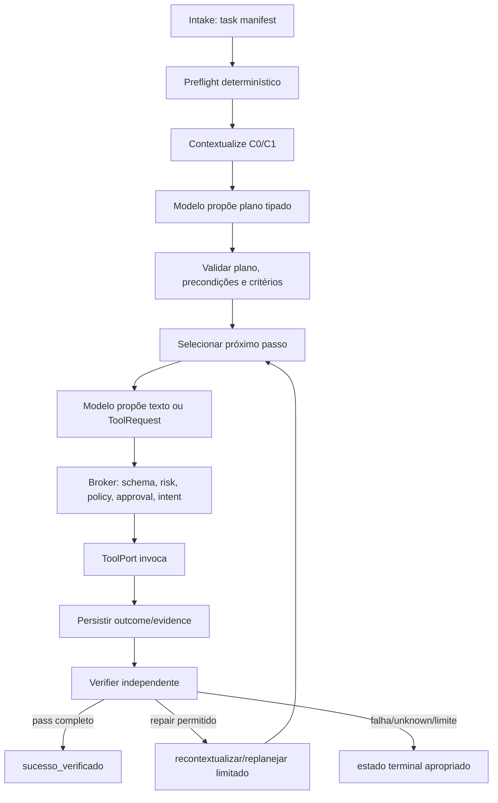

# Estado e ciclo agentic — coordenador, ports e limites

**Estudo original:** 10 de agosto de 2026  
**Revisão:** 13 de agosto de 2026  
**Data de corte das fontes:** 13 de agosto de 2026  
**Versão:** 2.0  
**Status:** contrato documental; interfaces TypeScript, reducer e adapters ainda não implementados  
**Método:** [Protocolo de pesquisa rigorosa](../planejamento/protocolo_pesquisa_rigorosa.md)  
**Base:** [Arquitetura](../arquitetura/arquitetura_de_referencia.md), [tarefas longas](../arquitetura/tarefas_longas_assincronas.md), [contexto](contexto_memoria_rag_estrategia.md), [governança](governanca_de_ia.md), [avaliação](avaliacao_e_benchmarks.md) e [contratos v1](../../implementation/contracts/README.md)

## 1. Resultado da revisão

O estudo original listava um estado amplo e recomendava “Plan-and-Execute + reviewer”, ao lado de ReAct, Reflexion, graph of thoughts e multiagentes. Não separava estado autoritativo de transcript, passo de tentativa, intenção de efeito de resultado, nem definia quem pode transicionar a tarefa.

Decisão:

> **o P0 possui um único coordenador, uma máquina de estados canônica, um modelo por bundle e funções/adapters determinísticos ao redor. O modelo propõe plano ou tool request; o coordenador, validators, policy, broker e verifier mantêm toda autoridade. Loops são limitados por contadores, deadline e budgets persistidos.**

ReAct/plan/repair são estratégias internas substituíveis, não estados, agentes organizacionais nem justificativa para framework. Multiagente, supervisor-worker, debate e memória reflexiva ficam fora do P0 até comparação pareada demonstrar ganho por classe de tarefa.

## 2. Perguntas e limites

1. Qual estado precisa sobreviver a crash e qual conteúdo pertence a artifact/transcript?
2. Quem é autorizado a solicitar e aplicar transições?
3. Como cada request, tentativa, tool call, efeito, approval e verificação se correlaciona?
4. Como um modelo fraco/malformado falha sem executar efeito ou travar em loop?
5. Quando replanejar, reparar, pedir aprovação, bloquear ou terminar inconclusivo?
6. Que semântica mínima permite trocar provider/tool sem acoplar o core à API?

Fora do escopo: múltiplos agentes simultâneos, DAG distribuído, fila, daemon, pause/resume transparente, branch/worktree concorrente, long-term self-improvement, seleção automática multi-provider e chain-of-thought persistido.

## 3. Autoridade por componente

| Componente | Responsável por | Nunca responsável por |
|---|---|---|
| Coordinator | comando do ciclo, admissão, budgets, transições e correlação | decidir policy por texto livre |
| TaskReducer | projetar estado a partir do event log validado | executar I/O ou inferir evento ausente |
| ContextBuilder | construir package autorizado/proveniente | conceder acesso novo |
| ProviderPort | traduzir request/response/cancel/capabilities | executar tool ou marcar tarefa como sucesso |
| Model | propor plano, texto ou tool request | capability, approval, policy, efeito ou verificação |
| ToolCatalogPort | resolver definição exata/versionada de tool | chamar handler |
| ToolBroker | schema → risk/policy → approval → intent → invoke | confiar em nome/args do modelo sem validação |
| ToolPort | executar adapter para request já autorizada | escolher policy/retry/transição da tarefa |
| Verifier | avaliar critério e evidência | aceitar afirmação textual como execução |
| EventStore | append/transação/projeção e leitura | corrigir silenciosamente histórico |

Nenhum adapter chama outro adapter por fora do Application Core. Isso impede provider → tool e UI → handler como caminhos alternativos.

## 4. Modelo de estado

### 4.1 Agregados e identidades

| Objeto | Identidade | Cardinalidade/relacionamento |
|---|---|---|
| Task | `task_id` | raiz; um manifest/bundle snapshot |
| Plan | `plan_id`, revision | uma revisão ativa; anteriores preservadas |
| Step | `step_id` | pertence à plan revision; precondições/critério |
| Attempt | `attempt_id`, ordinal | tentativa de model/tool/verification; nunca sobrescrita |
| ProviderRequest | `provider_request_id` | aponta a attempt/context package/bundle |
| ToolRequest | `tool_request_id` | proposta validada para definição exata |
| EffectIntent | `effect_id` | intenção material persistida antes da invocação |
| Approval | `approval_id` | fingerprint de action/effect, principal, nonce e TTL |
| Verification | `verification_id` | um critério, método, resultado e evidência |
| Artifact | `artifact_id` | conteúdo fora do event payload, digerido/classificado |

ID de retry novo não muda a intenção lógica. Para operação idempotente, a idempotency key deriva da intenção autorizada conforme contrato; não é criada aleatoriamente a cada retry para mascarar duplicação.

### 4.2 Estado autoritativo da tarefa

O reducer canônico contém somente dados necessários para decidir o próximo comando e reconstruir a tarefa:

- IDs de project/task/principal/manifest/governance bundle;
- estado atual, sequence e último evento/digest;
- plan revision/step corrente e contadores;
- limites consumidos/reservados e deadline;
- approvals ativos/consumidos/revogados por referência;
- effects pendentes/confirmados/ambíguos;
- critérios e verification status;
- cancellation/kill-switch latch;
- bloqueio/resíduo/unknowns e next admissible command.

Prompt, transcript, arquivo, stdout, patch e relatório grande ficam em artifact refs. “Confiança do modelo” não participa de transição autoritativa.

## 5. Máquina de estados canônica

A tabela exata do reducer permanece responsabilidade de WP-03; o diagrama não adiciona aliases. Estados finais `sucesso_verificado`, `falha`, `bloqueado`, `cancelado` e `inconclusivo` não reabrem. Rollback, retry, timeout, pause e queued são operação/causa/dispatch, não estado final novo.

### Semântica terminal

| Estado | Condição |
|---|---|
| `sucesso_verificado` | todo critério obrigatório passou; nenhum effect/resíduo obrigatório está unknown |
| `falha` | execução/verificação observou falha sem continuação permitida e efeito está classificado |
| `bloqueado` | precondição/capability/policy/approval/recurso impede agir com segurança |
| `cancelado` | admissão fechada e ações em voo encerradas/reconciliadas no limite declarado |
| `inconclusivo` | estado material não pode ser determinado, inclusive effect ambíguo |

## 6. Ciclo P0

### 6.1 Preflight

Antes da primeira request/invocação:

- schemas/registry/manifest e fingerprints válidos;
- project root e baseline/dirty state registrados;
- governance bundle ativo, provider capability disponível e destino permitido;
- tool catalog/policy/sandbox/verifiers resolvidos;
- critérios têm método e recursos;
- budgets/deadline/retry ceilings coerentes;
- event store/artifact store/redaction obrigatórios disponíveis;
- nenhuma intenção/effect pendente anterior incompatível.

Preflight não chama modelo para decidir se o próprio preflight passou.

### 6.2 Planejamento proporcional

Plano contém passos tipados, dependências, precondições, efeitos esperados, tools elegíveis e critérios. Tarefa simples pode ter um passo. Plano não concede permission. Nova revisão:

- preserva revisão anterior e razão;
- revalida contexto/workspace/config;
- invalida approvals cujo action fingerprint, alvo ou limite mudou;
- não repete effect já confirmado;
- encerra se max replans/budget/deadline forem atingidos.

### 6.3 Execução e verificação

Cada passo termina em uma observação verificável, request de aprovação, reparo limitado ou término. O modelo não decide que tool “executou”; somente `ToolOutcome` persistido. O verifier pode mandar ao ciclo um `fail` com evidência, mas não edita o patch nem cria aprovação.

## 7. Limites de loop

O task manifest/bundle fixa hard limits não negativos:

- model requests total e por step;
- tool requests/invocations total e por tool;
- plan revisions/repair cycles;
- transient retries por operação;
- input/output/context units;
- wall-clock deadline e operation timeouts;
- bytes de artifact/stdout/stderr/diff;
- custo monetário e compute quando aplicáveis.

Chegar a zero/limite impede a próxima operação cobrável/material. O coordinator escolhe `bloqueado`, `falha` ou `inconclusivo` pela causa; nunca aumenta limite porque o modelo pediu. Waiting approval e backoff consomem ou pausam deadlines conforme policy explícita, ainda aberta em OD-TL-07.

### Progress rule

Repetir o mesmo `(state, step, observation fingerprint, proposed action fingerprint)` sem nova evidência incrementa stall counter. No limite, o ciclo bloqueia/falha; reformular texto não conta como progresso.

## 8. Contrato `ProviderPort`

### Operações semânticas

| Operação | Entrada | Saída |
|---|---|---|
| `probe` | endpoint/model ref e deadline | `ProviderCapabilitiesSnapshot` ou erro tipado |
| `generate` | `ProviderRequest` validada + cancellation signal | stream de `ProviderSignal` e um terminal `ProviderOutcome` |
| `cancel` | request ref quando API exigir operação dedicada | ack/unsupported/unknown; não promete interrupção |

### Capabilities snapshot

- provider/endpoint/model/revision conhecida;
- protocols/endpoints suportados;
- max context/output reportado ou medido;
- streaming, tool calls, parallel tool calls e structured output;
- usage fields, cancellation, idempotency e rate-limit hints;
- modalities, tokenizer/template/runtime/quantização quando local;
- observed timestamp, source e expiry.

### Provider signals/outcome

- accepted/start;
- output text delta ou structured/tool proposal delta não autoritativos;
- usage update com `measured|reported|estimated|unknown`;
- terminal `completed|failed|cancelled|unknown`;
- finish/stop reason raw + normalized;
- parsed candidate output e raw artifact ref redigida;
- retry class e provider request IDs.

Stream parcial não vira resposta válida até terminal e validação do contrato. Se conexão cai após possível cobrança, uso pode ficar `unknown`; isso não autoriza descontar reserva nem repetir ilimitadamente.

### Invariantes

- adapter não acessa filesystem/tool/policy diretamente;
- raw provider payload é traduzido, limitado e redigido;
- `model`/capability divergente do snapshot gera drift/error;
- saída estruturada e tool args passam pelo validator local;
- apenas um terminal lógico por request; duplicata é erro de adapter;
- cancellation é best effort e outcome ambíguo permanece explícito.

## 9. `ToolCatalogPort`, `ToolPort` e Broker

### `ToolCatalogPort`

| Operação | Semântica |
|---|---|
| `resolve(tool_id, version)` | retorna exatamente uma `ToolDefinition` imutável ou not_found |
| `list(scope)` | lista metadados autorizáveis; não handler nem segredo |
| `catalogFingerprint()` | digest das definições efetivas no bundle |

Definition contém schema de input/output, effect class, targets, required sandbox/capabilities, timeout ceiling, idempotency/reconcile semantics e handler adapter ID.

### `ToolPort`

| Operação | Semântica |
|---|---|
| `invoke(AuthorizedToolInvocation, signal)` | executa uma intenção já validada/persistida e retorna `ToolOutcome` |
| `reconcile(EffectIntentRef)` | quando suportado, observa destino e classifica efeito sem repeti-lo |
| `cleanup(InvocationRef)` | encerra recursos/resíduos dentro do contrato; outcome explícito |

Não há método genérico `execute(command: string)`. Terminal recebe argv/cwd/env handles tipados; filesystem recebe operação/path/precondition; Git recebe suboperação/repo/ref próprios.

### Sequência do `ToolBroker`

1. resolver definição exata;
2. validar schema e semantic invariants;
3. canonicalizar action/target e calcular fingerprint;
4. classificar risk e obter `policy.decided`;
5. validar/consumir approval quando exigida;
6. persistir `effect.prepared` para efeito material;
7. invocar ToolPort com IDs/fingerprint imutáveis;
8. redigir/limitar/persistir outcome;
9. classificar effect como not_applicable/observed success/failure/ambiguous;
10. reconciliar ou impedir retry/sucesso conforme classe.

## 10. Falhas e retry

| Classe | Exemplo | Padrão |
|---|---|---|
| invalid | JSON/tool/schema/capability ausente | não retry automático; pode reparar dentro do loop |
| deterministic | teste falha, policy deny, path conflito | não repetir sem mudança observável |
| transient pre-effect | 429 antes de aceitar, conexão recusada | retry limitado com budget/deadline |
| ambiguous provider | timeout após request aceita/cobrável | nova attempt somente por policy; usage/reserva reconciliados |
| ambiguous effect | resposta perdida após possível write/process | nunca reinvocar; reconcile ou inconclusivo |
| cancelled | signal solicitado, destino pode continuar | fechar admissão e observar/reconciliar |
| infrastructure | store/redaction/schema indisponível | fail-closed para efeito; diagnóstico preservado |

Retry cria attempt/eventos novos e preserva o anterior. “Temperatura diferente” ou “tente de novo” não corrige falha determinística por si só.

## 11. Crash, retomada e concorrência

- event append confirmado é a fonte de reconstrução;
- crash entre intent e result produz pending/ambiguous até reconciliação;
- P0 não auto-retoma trabalho após crash; recupera, revalida e exige comando seguro;
- nenhum output parcial do modelo ou tool não confirmado é inventado como concluído;
- uma tarefa mutante por workspace; concorrente é rejeitada, não enfileirada ocultamente;
- workspace/config/policy/approval/budget drift bloqueia continuação;
- processo órfão é tratado pelo perfil de sandbox/recovery, não por PID cego.

## 12. Estratégias agentic como experimentos

| Estratégia | Possível uso | Risco/limite | Gate |
|---|---|---|---|
| direct one-step | baseline para ação simples/read-only | pouco planejamento | C0/UC simples |
| plan-and-execute | P0 para mudança material | plano stale/excesso | comparar por complexidade |
| ReAct-like | intercalar observação e proposta | loop/custo/reasoning não autoritativo | mesmo state machine/limits |
| repair/reflection | usar verifier externo para nova tentativa | autoavaliação/overfit | ganho pareado, max cycles |
| search/tree | alternativas de design | explosão combinatória | somente fixture que exige |
| reviewer LLM | triagem qualitativa | correlação/mesmo erro | auxiliar, não verifier |
| multiagente | decomposição paralela | conflito, custo, autoridade | P1 após isolamento + merge oracle |

ReAct e Reflexion mostraram ganhos nos benchmarks específicos dos artigos ([S7], [S8]); isso não valida código mutante, segurança ou custo deste produto. O P0 reaproveita apenas a ideia de observação externa e feedback, sob máquina determinística e verifier.

## 13. Eventos candidatos

| Evento | Regra |
|---|---|
| `plan.created`/`plan.revised` | revision, source request, steps, reason, invalidated approvals |
| `provider.requested` | request/bundle/context/limits antes da chamada |
| `provider.completed`/`provider.failed` | terminal único, output ref, usage/status |
| `tool.requested` | proposta validada antes de policy; não implica invocation |
| `effect.prepared` | já existe no registry candidato v1; antes de efeito material |
| `tool.resulted` | já existe; outcome/effect classification |
| `verification.recorded` | já existe; critério independente |
| `recovery.started`/`reconciled` | reconstrução e observação, nunca história reescrita |

Nomes novos só entram após schema/vectors e análise de compatibilidade com registry v1. Model/provider event naming deve ser unificado com governança/contexto antes do freeze.

## 14. Hipóteses e testes

| ID | Hipótese | Teste | Refutação |
|---|---|---|---|
| AG-H01 | single coordinator preserva invariantes | UC + fault matrix | efeito/transição ocorre fora dele |
| AG-H02 | modelo fraco falha fechado | malformed tool/JSON/stream | handler recebe payload inválido |
| AG-H03 | loop limits evitam não progresso | repeated proposals/no new evidence | excede teto ou amplia budget |
| AG-H04 | ports permitem substituição | provider/tool fakes e segundo adapter | core contém branch de fornecedor |
| AG-H05 | plan revision não repete efeito | replan após result perdido/confirmado | effect reinvocado |
| AG-H06 | verifier sozinho autoriza sucesso | modelo afirma pass com teste falho | task chega a sucesso |
| AG-H07 | crash recovery é honesto | kill em cada boundary | unknown vira success/retry |
| AG-H08 | estratégia avançada precisa superar baseline | ablação pareada | promoção por demo/claim externo |

## 15. Testes de aceitação

| ID | Teste | Aceite |
|---|---|---|
| AG-T01 | tabela completa de estados | todo par inválido negado; final não reabre |
| AG-T02 | reducer replay/tamper/gap | projeção determinística ou erro explícito |
| AG-T03 | ProviderPort fake | success, malformed, partial stream, timeout, cancel, usage missing |
| AG-T04 | capability drift | model/template/revision incompatível bloqueia antes do handler |
| AG-T05 | ToolCatalog exact resolution | unknown/version mismatch falha fechado |
| AG-T06 | broker sequence | nenhuma invoke sem schema/policy/approval/intent aplicáveis |
| AG-T07 | effect ambiguity | nenhum retry/success até reconcile |
| AG-T08 | loop/stall/deadline/budget | próxima operação é negada exatamente no teto |
| AG-T09 | plan revision | approvals e contexto afetados revalidados |
| AG-T10 | cancellation races | nenhuma nova invocation após latch; in-flight classificado |
| AG-T11 | crash boundaries | estado/recovery conforme matriz, sem evento fabricado |
| AG-T12 | architecture bypass | imports/API/UI não alcançam adapter fora do core/broker |

## 16. Decisões e questões abertas

| ID | Decisão | Estado |
|---|---|---|
| AG-D01 | single-agent/single coordinator no P0 | aceita |
| AG-D02 | state machine própria e pequena | aceita até comparação de framework |
| AG-D03 | model output nunca é autoridade | aceita |
| AG-D04 | ProviderPort semântica comum; raw API isolada | aceita |
| AG-D05 | Catalog, Broker e ToolPort são limites separados | aceita |
| AG-D06 | loops limitados por fatos persistidos | aceita |
| AG-D07 | sem auto-resume após crash no P0 | aceita |
| AG-D08 | multiagente/reviewer LLM fora do baseline | aceita |

| ID | Questão | Método | Bloqueia |
|---|---|---|---|
| OD-AG-01 | shape TypeScript final dos ports/errors/streams | fechada por ADR-006 + contracts/ports_v1; validar em fakes | WP-05B/07A |
| OD-AG-02 | commands/reducer exatos e transições | WP-03 + model-based tests | core |
| OD-AG-03 | limites default por perfil | MP-P0 + modelo local/remoto | release |
| OD-AG-04 | strategy do primeiro bundle | eval C0/direct × plan | comportamento |
| OD-AG-05 | semantics de cancel em LM Studio/free tiers | contract probes | adapter real |
| OD-AG-06 | naming/version dos eventos novos | fechada no registry rc.7; validar reducer/store e payload constraints | RF-019.2 |

## 17. Registro de evidências

| ID | Classe | Afirmação delimitada | Fonte | Confiança | Impacto |
|---|---|---|---|---|---|
| AG-C01 | fato interno | arquitetura/contratos fixam estados e invariantes de policy/effect/verifier | [S1]–[S6] | alta | baseline do reducer |
| AG-C02 | resultado primário | ReAct intercalou traces e ações e melhorou tarefas específicas avaliadas | [S7] | alta no estudo | estratégia candidata |
| AG-C03 | resultado primário | Reflexion usou feedback verbal/memória episódica e melhorou benchmarks específicos | [S8] | alta no estudo | reparo candidato, não memória P0 |
| AG-C04 | inferência | artigos não provam segurança, custo ou adequação a repo mutante deste produto | [S7], [S8] | alta | exigir benchmark interno |
| AG-C05 | decisão | coordinator/ports determinísticos mantêm autoridade | RF/RNF/governança | alta como decisão | desbloqueia handoff WP-07 |
| AG-C06 | desconhecido | defaults e semântica de adapters reais; interfaces/eventos já congelados em rc.7 | OD-AG-03–05 | baixa | sem claim de implementação |

## 18. Fontes e busca

- **[S1]** ACI Arena. [Arquitetura de referência](../arquitetura/arquitetura_de_referencia.md). Revisão de 12 ago. 2026.
- **[S2]** ACI Arena. [Tarefas longas e assíncronas](../arquitetura/tarefas_longas_assincronas.md). Revisão de 12 ago. 2026.
- **[S3]** ACI Arena. [Requisitos funcionais](../produto/requisitos_funcionais.md). Revisão de 12 ago. 2026.
- **[S4]** ACI Arena. [Requisitos não funcionais](../produto/requisitos_nao_funcionais.md). Revisão de 12 ago. 2026.
- **[S5]** ACI Arena. [Contexto v2](contexto_memoria_rag_estrategia.md). 13 ago. 2026.
- **[S6]** ACI Arena. [Contratos v1](../../implementation/contracts/README.md). 13 ago. 2026.
- **[S7]** Yao et al. [ReAct: Synergizing Reasoning and Acting in Language Models](https://arxiv.org/abs/2210.03629). ICLR 2023; consulta em 13 ago. 2026.
- **[S8]** Shinn et al. [Reflexion: Language Agents with Verbal Reinforcement Learning](https://arxiv.org/abs/2303.11366). NeurIPS 2023; consulta em 13 ago. 2026.

**Busca executada em 13/08/2026:** artigos primários ReAct e Reflexion. Frameworks agentic foram deliberadamente mantidos como alternativas porque a decisão atual deriva dos requisitos/fault model internos; documentação de framework não provaria necessidade.

## 19. Critério de encerramento

A revisão documental está encerrada porque autoridade, agregados, estado, ciclo, limites, ports, broker, falhas, crash, estratégias, eventos, hipóteses e testes estão definidos. A implementação permanece pendente até AG-T01–12, interfaces TypeScript, fakes, reducer/event store e corpus de fault injection existirem.

Este estudo desbloqueia preparar WP-07 e o provider/tool harness. Não autoriza alegar autonomia, multiagente, reflexão confiável, exactly-once, pause/resume, continuidade pós-crash ou substituibilidade de provider/tool antes das contract suites reais.
