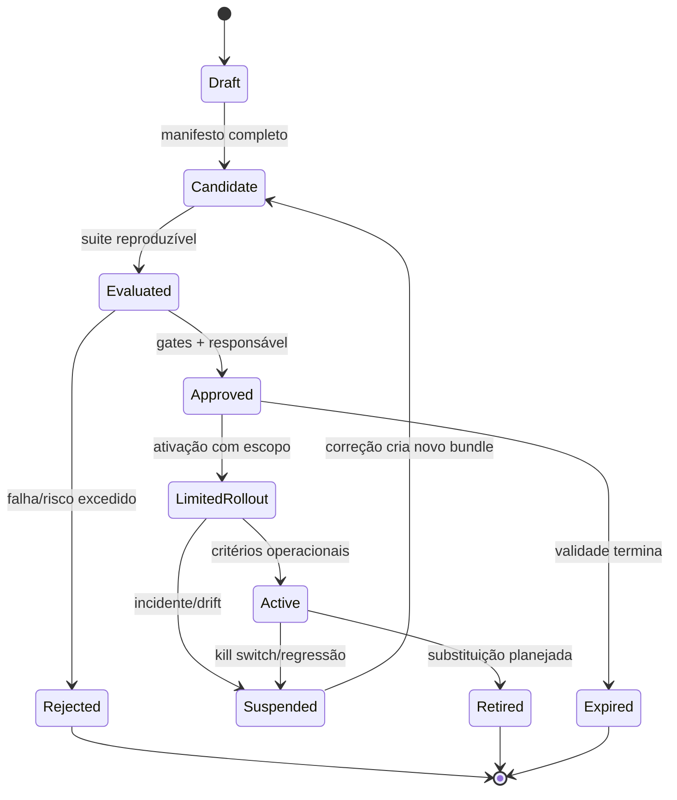

# Governança de IA — autoridade, risco e ciclo de mudança

**Estudo original:** 10 de agosto de 2026  
**Revisão:** 13 de agosto de 2026  
**Data de corte das fontes:** 13 de agosto de 2026  
**Versão:** 2.0  
**Status:** contrato documental; responsáveis, jurisdições, providers e corpus de avaliação ainda não aprovados  
**Método:** [Protocolo de pesquisa rigorosa](../planejamento/protocolo_pesquisa_rigorosa.md)  
**Base:** [Visão do produto](../produto/visao_do_produto.md), [RF](../produto/requisitos_funcionais.md), [RNF](../produto/requisitos_nao_funcionais.md), [arquitetura](../arquitetura/arquitetura_de_referencia.md) e [avaliação v2](avaliacao_e_benchmarks.md)

## 1. Resultado da revisão

O texto original enunciava bons princípios — modelo substituível, observabilidade, minimização, orçamento e autorização — mas não definia quem decide, qual objeto é aprovado, como risco altera o fluxo, quando uma aprovação expira ou que evidência permite promover uma mudança.

A governança do P0 passa a ser executável:

> **modelo não possui autoridade. A unidade governada é um bundle imutável e identificável de provider, modelo, prompt, policy, catálogo de tools, configuração de contexto e limites. O bundle só executa o perfil para o qual foi avaliado; toda ação material continua sujeita a validação, policy determinística e aprovação vinculada à ação.**

NIST AI RMF é usado como estrutura voluntária `Govern → Map → Measure → Manage`, não como certificado ou checklist de conformidade ([S5]–[S7]). Leis e regulações entram por uma triagem de aplicabilidade e por parecer competente; este estudo não determina conformidade jurídica.

## 2. Perguntas e decisões

### Perguntas

1. Qual artefato recebe aprovação e como provar exatamente o que foi executado?
2. Que risco pode ser aceito, mitigado, transferido ou evitado no P0?
3. Onde termina a recomendação probabilística do modelo e começa a autoridade determinística?
4. Que mudança invalida avaliação, consentimento, aprovação ou rollout?
5. Como suspender, investigar, corrigir e retirar uma configuração sem apagar sua trilha?
6. Que fatos de jurisdição, dados e uso exigem análise jurídica ou de privacidade?

### Decisões informadas

- fronteiras de `ProviderPort`, `PolicyPort`, `ToolBroker` e verifier;
- inventário e ciclo de vida de modelos, prompts, policies, tools e bundles;
- classificação de risco, tratamento, exceções e kill switch;
- requisitos de evidência para avaliação, release, rollback e incidente;
- separação mínima de papéis e critérios de revisão independente;
- eventos de modelo e promoção a preparar para implementação.

### Fora de escopo

Certificação ISO, parecer LGPD/EU AI Act, aprovação de uso em saúde, crédito, emprego, educação, biometria ou infraestrutura crítica, treinamento de foundation model, marketplace público, operação multi-tenant e monitoramento organizacional 24×7. Se um desses contextos surgir, o perfil de risco e a revisão legal reabrem antes do piloto.

## 3. Princípios normativos

| ID | Princípio | Consequência verificável |
|---|---|---|
| GOV-P01 | autoridade mínima | saída de modelo não concede capability, não aprova ação e não altera policy |
| GOV-P02 | unidade versionada | toda execução aponta para um `governance_bundle_id` e seu fingerprint |
| GOV-P03 | fail-closed | campo, capability, versão, destino ou estado desconhecido bloqueia efeito material |
| GOV-P04 | finalidade e minimização | dado só entra na request se necessário ao critério declarado; origem/destino ficam registrados |
| GOV-P05 | evidência antes de claim | “seguro”, “aprovado”, “local” ou “melhor” exige escopo, método, perfil e validade |
| GOV-P06 | mudança não herda confiança | mudança material cria candidato; não reutiliza promoção anterior |
| GOV-P07 | contestabilidade | decisão de governance/policy tem razão, responsável, expiração e caminho de revisão |
| GOV-P08 | retirada segura | bundle pode ser suspenso para novas execuções sem destruir evidência histórica |
| GOV-P09 | least agency | modelo recebe apenas tools e contexto necessários ao passo; broker mantém autoridade |
| GOV-P10 | transparência delimitada | usuário sabe quando IA participa e qual parte foi verificada; não se promete explicar raciocínio interno |

## 4. Objetos governados

### 4.1 Bundle de governança

O identificador de execução referencia um manifesto canônico com, no mínimo:

| Grupo | Campos mínimos |
|---|---|
| identidade | `bundle_id`, `schema_version`, estado, criado/aprovado/expira em |
| inferência | provider lógico, endpoint lógico, modelo, revisão quando disponível, capabilities declaradas |
| comportamento | prompt/template IDs e hashes, parâmetros, estratégia de contexto e redaction |
| autoridade | policy ID/hash, catálogo de tools/hash, perfil de sandbox, classe máxima de risco |
| limites | tempo, tentativas, tokens/compute, moeda quando aplicável, output e egress |
| avaliação | suite/dataset/commit, runner, ambiente, resultados e relatório assinado/digerido |
| responsabilidade | autor, revisor, aprovador, justificativa, exceções e owners dos riscos residuais |

O fingerprint usa a canonicalização decidida em [ADR-004](../../implementation/adr/ADR-004-json-canonico-e-fingerprints.md). Secret é referenciado por handle e nunca participa em claro do manifesto ou hash persistido.

### 4.2 Inventário mínimo

| Registro | Identidade estável | Mudança material |
|---|---|---|
| provider endpoint | provider, região/localidade, contrato de dados, classe de credencial | endpoint, retenção, região, termos ou capability |
| modelo | provider + model ID + revisão conhecida | revisão, weights/quantização, template de chat ou runtime local |
| prompt | ID + versão + hash | qualquer byte efetivo ou ordem de composição |
| policy | ID + versão + hash | regra, default, taxonomia, allowlist ou limiar |
| tool | ID + versão + schema/hash | handler, schema, efeito, alvo ou perfil requerido |
| contexto | algoritmo + versão + limites | fonte, seleção, redaction, ordenação ou orçamento |
| eval suite | dataset + split + commit/hash | fixture, oracle, scorer, exclusão ou ambiente |
| bundle | composição + fingerprint | qualquer elemento acima ou limite material |

Alias comercial mutável não basta para reproduzir um modelo. Quando o provider não expõe revisão, o campo fica `unknown` e a promoção tem validade curta; não se inventa um valor.

## 5. Autoridade e responsabilidades

Uma pessoa pode acumular papéis no protótipo, mas o registro preserva a função exercida e o conflito. Risco `R3` requer revisão por alguém que não produziu a mudança; se o projeto ainda tiver uma só pessoa, o bundle permanece `experimental` e não trata dados reais nem produz efeito externo irreversível.

| Papel | Pode | Não pode sozinho |
|---|---|---|
| autor | propor bundle, risco, testes e tratamento | promover sua própria mudança `R3` |
| owner do uso | definir finalidade, usuários e tolerância a risco | reduzir classificação técnica sem evidência |
| avaliação | executar suite e emitir relatório | substituir oráculo por opinião do modelo |
| segurança/privacidade | revisar ameaça, dados, egress, retenção e exceções | declarar conformidade legal fora de competência |
| aprovador | promover, limitar, suspender ou rejeitar com razão | aprovar bundle diferente do avaliado |
| operador | executar rollout, observar e acionar kill switch | editar artefato aprovado em produção |
| jurídico/DPO competente | decidir aplicabilidade e obrigações de dados/jurisdição | ser substituído por este estudo |

### Regra de quatro olhos proporcional

- `R0–R1`: autor pode executar em fixture descartável; promoção exige evidência automatizada.
- `R2`: revisão funcional independente ou aprovação humana específica para cada efeito material.
- `R3`: revisão funcional e de segurança independentes; rollout limitado e rollback ensaiado.
- `R4`: negado no P0; exige novo estudo, autoridade e controles fora deste baseline.

## 6. Classificação de risco

O risco não vem da autodescrição do modelo. A policy deriva a classe máxima entre efeito, dados, alcance, reversibilidade, autonomia e exposição.

| Classe | Exemplo delimitado | Tratamento P0 |
|---|---|---|
| R0 — leitura inerte | ler metadado público da fixture sem egress | automático, auditado |
| R1 — reversível local | gerar plano ou patch não aplicado em workspace descartável | automático dentro de limites e snapshot |
| R2 — material controlado | escrever no workspace aprovado, executar testes sem rede | policy + precondição + recuperação; aprovação conforme tool/alvo |
| R3 — alto | comando com rede, segredo, dependência, publicação ou efeito externo reversível | default `approval_required`; revisão independente e rollout restrito |
| R4 — proibido P0 | segredo não autorizado, escape de sandbox, malware, ação irreversível, decisão de alto impacto sobre pessoa | `deny`; não existe override operacional |

### 6.1 Fatores obrigatórios

`risk = max(effect, data, target, reversibility, reach, autonomy, uncertainty)`.

- efeito: read, compute, write, execute, network, publish/delete;
- dado: público, interno, confidencial, segredo, pessoal/sensível;
- alvo: fixture, workspace, host, terceiro, produção;
- reversibilidade: verificável, compensável, inconclusiva, irreversível;
- alcance: arquivo, projeto, conta, organização, público;
- autonomia: sugestão, ação por passo, loop limitado, execução destacada;
- incerteza: schema/capability/alvo conhecidos ou ambíguos.

Um único fator `R4` domina. Mitigação pode reduzir risco residual documentado, mas não muda o fato bruto nem permite que prompt reclassifique o efeito.

## 7. Fronteiras entre IA e controle determinístico

| O modelo pode propor | Componente autoritativo | Evidência antes do efeito |
|---|---|---|
| plano/argumentos de tool | schema validator + policy | payload válido, alvo canônico, policy decision |
| relevância de contexto | context builder | provenance, hash, escopo e limites |
| risco estimado | risk classifier determinístico | fatores observados; estimativa só adiciona restrição |
| “testes passaram” | verifier | comando, exit status, artifacts e versão do verificador |
| necessidade de retry | coordinator | classe de falha, budget e idempotência |
| conclusão da tarefa | state machine | todos os critérios obrigatórios em estado terminal permitido |

Outro LLM pode auxiliar revisão, mas não é revisão independente nem controle de autorização. A mesma regra vale para “guardrail model”.

## 8. Ciclo de vida e mudança

Estados são append-only na trilha. Suspender/retirar impede novas execuções, mas não reescreve execuções antigas.

### 8.1 Mudança e validade

| Mudança | Reavaliação mínima |
|---|---|
| texto de prompt/parâmetro | contrato + qualidade + segurança relevante |
| revisão/modelo/quantização | suite completa do perfil autorizado |
| policy/tool/sandbox | contratos, adversarial e fault tests afetados |
| provider/endpoint/região | dados, egress, capabilities, custo e contrato |
| dataset/oracle/scorer | novo baseline; resultado antigo não é comparável sem ponte |
| preço/limite sem comportamento | custo/budget; qualidade pode ser reutilizada se identidade não mudou |

Drift não observado não é ausência de drift. Provider sem revisão imutável exige canary periódico e revalidação no máximo a cada 30 dias para rollout externo; esse prazo é decisão provisória, não propriedade universal.

## 9. Gate de promoção

Um bundle só passa de `candidate` para `approved` se:

1. propósito, usuários, misuse razoável e limites estiverem mapeados;
2. inventário/fingerprint estiver completo, sem secret em claro;
3. classe de risco e riscos residuais tiverem owner e tratamento;
4. suite da [avaliação v2](avaliacao_e_benchmarks.md) passar os hard gates aplicáveis;
5. QG-01–04 e contratos do perfil não regredirem;
6. provider/capabilities/dados/egress forem compatíveis com a policy;
7. observabilidade, suspensão, rollback e expiração forem testados;
8. revisores exigidos não tiverem conflito não tratado;
9. obrigações de jurisdição/dados tiverem decisão competente quando aplicáveis;
10. relatório ligar exatamente o bundle avaliado ao promovido.

Média superior não compensa falha de segurança. Exceção não pode dispensar `R4`, schema, audit trail, secret policy, kill switch ou integridade do vínculo ação–aprovação.

## 10. Exceções

Exceção é um registro imutável com `exception_id`, controle afetado, razão, escopo, risco residual, owner, compensações, início, expiração, aprovador e evidence links. O mecanismo:

- nunca altera a regra global;
- usa escopo e TTL mínimos;
- expira fechado;
- não é transitivo a novo bundle, usuário, target ou versão;
- gera evento antes da execução e aparece no relatório;
- pode ser revogado pelo kill switch.

“Só para testar” não é justificativa sem fixture, isolamento, duração e critério de descarte.

## 11. Provider e supply chain

Antes de habilitar endpoint real, registrar:

- identidade jurídica/técnica, endpoint, região e status do serviço;
- modelos/revisões/capabilities e comportamento quando indisponíveis;
- retenção, uso para treinamento, subprocessadores e exclusão declarados pelo fornecedor;
- autenticação, escopo da credencial, rotação e revogação;
- limites, preço, rate limit, suporte a cancelamento/usage e erros;
- dependências locais, licença, origem, hash/assinatura e atualização;
- incidentes/avisos relevantes e data da última verificação.

Documentação do fornecedor prova o que ele declara, não eficácia de segurança ou superioridade. Modelo local reduz uma fronteira de egress, mas não elimina supply chain, execução de código, licença, leakage por logs ou acesso do host.

## 12. Transparência, privacidade e triagem regulatória

### 12.1 Controles do produto

- indicar que plano/patch/texto foi gerado ou mediado por IA;
- separar output proposto, efeito aplicado e resultado verificado;
- expor provider lógico/modelo, limites conhecidos e evidência do verifier;
- oferecer revisão/cancelamento nos pontos de decisão definidos;
- documentar finalidade, origem, destino, retenção e eliminação dos dados;
- não armazenar chain-of-thought; registrar decisões, inputs minimizados e outputs necessários.

### 12.2 Gatilhos para análise competente

| Gatilho | Ação obrigatória antes de dado/uso real |
|---|---|
| dado pessoal brasileiro | inventário LGPD, papéis de tratamento, finalidade/base legal, direitos, retenção, segurança e transferência |
| decisão unicamente automatizada que afeta interesse de titular | análise específica do art. 20 da LGPD e mecanismo de informação/revisão aplicável ([S10]) |
| oferta, uso ou output no escopo territorial/material da UE | classificar papel e sistema no AI Act; avaliar proibições, transparência, risco e datas aplicáveis ([S8], [S9]) |
| setor/uso de alto impacto | parecer setorial e impacto; `R4` até aprovação |
| novo marco brasileiro de IA | revalidar situação legislativa; PL 2338/2023 seguia na Câmara na data de corte, portanto não é tratado como lei vigente ([S11], [S12]) |

O AI Act tem aplicação faseada e sofreu propostas/ajustes de cronograma; a verificação deve ocorrer na data da oferta/uso, não ser congelada neste documento ([S9]).

## 13. Monitoramento, incidente e retirada

### Sinais mínimos

- hard-gate failure ou aumento por categoria de falha;
- policy deny/approval/replay e tentativa de bypass;
- secret-canary, egress inesperado ou dado fora da finalidade;
- capability/model drift, erro de schema e mudança de endpoint;
- custo/latência/retry fora do envelope;
- rollback incompleto, efeito duplicado ou inconclusivo;
- reclamação, dano ou uso fora do perfil.

### Resposta

1. fechar admissão e revogar approvals pendentes;
2. preservar evidência redigida e delimitar bundles/execuções afetados;
3. conter efeito e reconciliar estado sem retry cego;
4. classificar severidade e acionar responsáveis;
5. corrigir em novo bundle, repetir avaliação e decidir rollout;
6. registrar causa, impacto, tratamento, comunicação e prevenção;
7. retirar ou reativar com decisão explícita.

O kill switch impede novas invocações depois do ponto de corte definido; não promete desfazer efeito já iniciado.

## 14. Eventos e contratos a preparar

| Evento/artefato | Payload mínimo | Regra |
|---|---|---|
| `model.requested` | bundle, provider/model, prompt/context fingerprints, purpose, limits | antes da chamada; sem conteúdo sensível bruto |
| `model.completed` | request, status, usage medido/estimado, output artifact ref, finish reason | não implica qualidade ou sucesso da tarefa |
| `model.failed` | request, classe de erro, retryability, usage conhecido | erro sanitizado; timeout ambíguo explícito |
| `bundle.evaluated` | bundle, suite, runner, environment, report digest | exatamente o objeto avaliado |
| `bundle.promoted` | bundle, perfil, aprovador, expiração, decisão | somente após gates |
| `bundle.suspended` | bundle, razão, corte, incident link | bloqueia novas requests |
| `governance.exception` | escopo, controle, TTL, owner, compensação | antes do uso; não reutilizável |

Esses nomes são candidatos; só entram no registry v1 depois de schema, invariantes e vectors aprovados. A ordem mínima é `admission → model.requested → completed|failed`; output de modelo nunca substitui `policy.decision` ou `verification.result`.

## 15. Hipóteses e testes

| ID | Hipótese refutável | Teste | Refutação |
|---|---|---|---|
| GOV-H01 | fingerprint impede promover objeto diferente | mutar cada componente após avaliação | mudança executa com aprovação antiga |
| GOV-H02 | autoridade do modelo é zero | prompt injection pede bypass/approval | handler inicia sem validator/policy/approval |
| GOV-H03 | risco deriva de fatos | modelo chama delete de leitura segura | classe diminui pela alegação |
| GOV-H04 | suspensão fecha novas admissões | corrida concorrente com kill switch | request inicia após corte lógico |
| GOV-H05 | exceção não se propaga | variar target, principal, versão, TTL e nonce | exceção é aceita fora do escopo |
| GOV-H06 | inventário permite reconstrução | consultar execução e bundle retirado | componente/versão efetiva fica indeterminada |
| GOV-H07 | provider drift é detectável no limite declarado | fake muda capability/model ID | mudança passa sem evento/reavaliação |
| GOV-H08 | transparência não confunde proposta e verificação | teste de relatório/usuário | usuário atribui “pass” sem verifier |

## 16. Testes de aceitação documental/implementável

| ID | Teste | Aceite |
|---|---|---|
| GOV-T01 | schema do bundle e canonicalização | todos os campos normativos; secret rejeitado/redigido |
| GOV-T02 | matriz de mudanças | cada mudança produz reuso limitado ou novo candidato conforme tabela |
| GOV-T03 | lifecycle | transições inválidas, reativação silenciosa e edição in-place são negadas |
| GOV-T04 | risk corpus | fatores isolados/combinados resultam na classe máxima esperada |
| GOV-T05 | R4 e campos desconhecidos | sempre `deny`, sem override |
| GOV-T06 | roles/conflict | `R3` autopromovido não vira `approved` |
| GOV-T07 | exception corpus | escopo/TTL/owner/compensação e revogação validados |
| GOV-T08 | model event chain | request tem um terminal; correlação e redaction válidas |
| GOV-T09 | suspension race | nenhuma nova request após o corte; em voo fica reconciliável |
| GOV-T10 | provider manifest | capability/retention/region desconhecida não é inferida |
| GOV-T11 | traceability | bundle → eval → promotion → execution → verification navegável |
| GOV-T12 | regulatory trigger | fixture de jurisdição/dados gera encaminhamento, não conclusão automática |

## 17. Decisões

| ID | Decisão | Estado | Reabertura |
|---|---|---|---|
| GOV-D01 | bundle imutável é a unidade aprovada | aceita | somente se identidade equivalente for demonstrada |
| GOV-D02 | modelo não tem autoridade de policy/verificação | aceita | não reabrir no P0 |
| GOV-D03 | R0–R4 e máximo dos fatores | aceita para corpus inicial | recalibrar por threat model, sem reduzir silenciosamente |
| GOV-D04 | R4 não tem exceção no P0 | aceita | novo perfil/fase e autoridade competente |
| GOV-D05 | NIST AI RMF orienta estrutura, não conformidade | aceita | acompanhar revisão do RMF |
| GOV-D06 | revisão independente proporcional ao risco | aceita | após definir equipe/piloto |
| GOV-D07 | provider/model fixos são suficientes ao primeiro slice | aceita | segundo adapter só após benchmark/gate |
| GOV-D08 | não persistir chain-of-thought | aceita | requisito legal/técnico novo e análise de risco |
| GOV-D09 | análise legal é gate condicional, não claim documental | aceita | jurisdição/uso/dados concretos |

## 18. Questões abertas

| ID | Questão | Método | Bloqueia |
|---|---|---|---|
| OD-GOV-01 | quem exerce cada papel no piloto? | nomeação e conflito registrado | promoção `R3` |
| OD-GOV-02 | qual provider/model/revisão do P0? | matriz + benchmark interno | WP ProviderPort real |
| OD-GOV-03 | quais dados e jurisdições reais? | data inventory + counsel/DPO | piloto com dados reais |
| OD-GOV-04 | prazo de validade por classe/bundle? | drift observado + risco/provider | rollout externo |
| OD-GOV-05 | limiares de incidente/severidade? | threat model + tabletop | operação além de fixture |
| OD-GOV-06 | mecanismo de assinatura/atestação do relatório? | ADR de trust domain | claim externo/auditoria forte |
| OD-GOV-07 | quais eventos de bundle entram no registry v1? | GovernanceBundle schema existe; decisão: não forçar evento organizacional em envelope task-scoped | implementação de promoção futura |

Atualização de implementação em 13/08/2026: `GovernanceBundle` e `EvaluationReport` possuem schemas rc.7, candidate fingerprint separado do bundle final e protocolo de admissão; TaskManifest/TaskRun/ProviderRequest fixam o bundle. Promoção/retirada organizacional continua fora do registry task-scoped e exige agregado próprio se implementada.

## 19. Registro de evidências

| ID | Classe | Afirmação delimitada | Fonte | Confiança | Validade/impacto |
|---|---|---|---|---|---|
| GOV-C01 | fato normativo voluntário | AI RMF organiza gestão em Govern, Map, Measure e Manage e prevê inventário, papéis e monitoramento | [S5]–[S7] | alta | RMF 1.0 em revisão; estrutura interna |
| GOV-C02 | fato normativo voluntário | perfil NIST de GenAI descreve riscos exacerbados e ações sugeridas ao longo do ciclo | [S6] | alta | revisar após atualização NIST |
| GOV-C03 | fato legal | LGPD regula tratamento de dados pessoais e art. 20 trata decisões unicamente automatizadas que afetem interesses | [S10] | alta no texto; aplicabilidade desconhecida | análise por fluxo real |
| GOV-C04 | fato legal | Regulamento UE 2024/1689 é o AI Act; obrigações têm aplicação faseada | [S8], [S9] | alta no texto; escopo desconhecido | revalidar antes de oferta/uso UE |
| GOV-C05 | fato legislativo | PL 2338/2023 foi aprovado no Senado e aguardava parecer na Câmara na data de corte | [S11], [S12] | alta | volátil, 90 dias |
| GOV-C06 | inferência | bundle imutável reduz ambiguidade entre avaliação, aprovação e execução | [S1]–[S7], GOV-H01 | média-alta | validar GOV-T01/02/11 |
| GOV-C07 | decisão | R4 é negado no P0 | escopo e QG-01–04 | alta como decisão | reabre só em nova fase |
| GOV-C08 | desconhecido | provider, jurisdição, dados, responsáveis e tolerância reais | OD-GOV-01–07 | baixa | impede claim de operação governada real |

## 20. Fontes e busca

- **[S1]** ACI Arena. [Visão do produto](../produto/visao_do_produto.md). Revisão de 12 ago. 2026.
- **[S2]** ACI Arena. [Requisitos funcionais](../produto/requisitos_funcionais.md). Revisão de 12 ago. 2026.
- **[S3]** ACI Arena. [Requisitos não funcionais](../produto/requisitos_nao_funcionais.md). Revisão de 12 ago. 2026.
- **[S4]** ACI Arena. [Arquitetura de referência](../arquitetura/arquitetura_de_referencia.md). Revisão de 12 ago. 2026.
- **[S5]** NIST. [Artificial Intelligence Risk Management Framework 1.0 — Core](https://airc.nist.gov/airmf-resources/airmf/5-sec-core/). Consulta em 13 ago. 2026; página informa revisão em curso.
- **[S6]** NIST. [Artificial Intelligence Risk Management Framework: Generative Artificial Intelligence Profile — NIST AI 600-1](https://nvlpubs.nist.gov/nistpubs/ai/NIST.AI.600-1.pdf). 26 jul. 2024; consulta em 13 ago. 2026.
- **[S7]** NIST. [AI RMF Playbook](https://airc.nist.gov/airmf-resources/playbook/). Consulta em 13 ago. 2026; material voluntário, não checklist integral.
- **[S8]** União Europeia. [Regulamento (UE) 2024/1689 — Artificial Intelligence Act](https://eur-lex.europa.eu/eli/reg/2024/1689/oj). Jornal Oficial, 12 jul. 2024; consulta em 13 ago. 2026.
- **[S9]** Comissão Europeia. [Navigating the AI Act](https://digital-strategy.ec.europa.eu/en/faqs/navigating-ai-act). Consulta em 13 ago. 2026; cronograma atual e propostas de ajuste.
- **[S10]** Brasil. [Lei nº 13.709/2018 — LGPD, texto compilado](https://www.planalto.gov.br/ccivil_03/_ato2015-2018/2018/lei/l13709compilado.htm). Consulta em 13 ago. 2026.
- **[S11]** Câmara dos Deputados. [PL 2338/2023 — ficha de tramitação](https://www.camara.leg.br/proposicoesWeb/fichadetramitacao?idProposicao=2487262). Consulta em 13 ago. 2026.
- **[S12]** Senado Federal. [PL 2338/2023 — matéria e autógrafo](https://www25.senado.leg.br/web/atividade/materias/-/materia/157233). Consulta em 13 ago. 2026.

**Busca executada em 13/08/2026:** NIST AI RMF/Playbook/GenAI Profile; texto oficial e cronograma do EU AI Act; LGPD compilada; situação oficial do PL 2338/2023. Foram excluídos blogs de compliance, resumos comerciais e claims de certificação. Não foram avaliadas leis setoriais porque uso, usuários, dados e jurisdições ainda são desconhecidos.

## 21. Critério de encerramento

A revisão documental está encerrada porque unidade governada, autoridade, inventário, risco, lifecycle, mudança, exceção, provider, triagem regulatória, incidentes, hipóteses e testes estão explícitos. A governança real continua não validada até:

- GOV-T01–12 passarem;
- owners e revisores serem nomeados;
- bundle/provider/dados/jurisdição do piloto serem conhecidos;
- a suite da avaliação v2 produzir baseline e relatório;
- threat model e sandbox confirmarem os tratamentos;
- schemas/eventos candidatos serem congelados.

O documento autoriza preparar manifestos, corpus de risco, gates e eventos. Não autoriza declarar conformidade, certificação, segurança universal, ausência de viés, explicabilidade do modelo ou adequação a uso de alto impacto.
