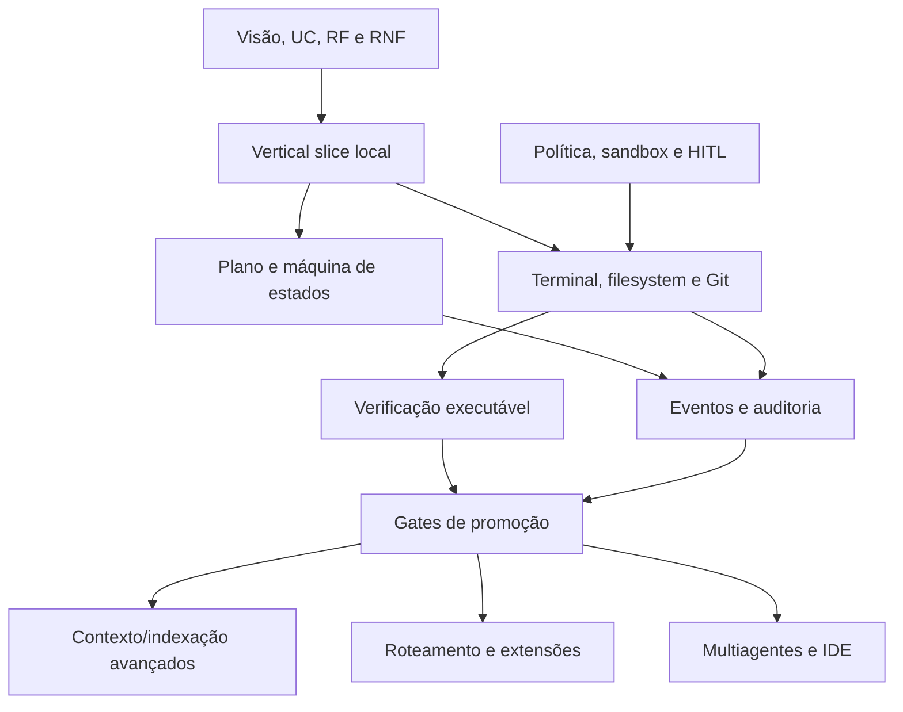

# Segunda revisão das abordagens dos temas técnicos

**Data:** 12 de agosto de 2026  
**Versão:** 1.0  
**Escopo:** 20 estudos em `docs/research/temas/`; a síntese foi tratada como índice, não como 21º tema  
**Status:** abordagens revisadas; experimentos e implementação permanecem pendentes  
**Método:** [Protocolo de pesquisa rigorosa](protocolo_pesquisa_rigorosa.md)  
**Base decisória:** [Visão do produto](../produto/visao_do_produto.md), [casos de uso](../produto/casos_de_uso.md), [requisitos funcionais](../produto/requisitos_funcionais.md) e [requisitos não funcionais](../produto/requisitos_nao_funcionais.md)

## 1. Conclusão executiva

A coleção original é um bom mapa de vocabulário, mas não sustenta as recomendações tecnológicas. Nos 20 arquivos não havia uma única ocorrência de “hipótese”, “baseline”, “alternativa”, fase `P0/P1/P2`, condição de refutação ou critério de rejeição; apenas dois citavam alguma métrica e o conjunto inteiro continha 28 URLs. “Tecnologias recomendadas” aparecia antes de problema mensurável, comparação ou custo operacional.

A melhoria transversal é substituir **tool-first** por **evidence-first**:

1. demonstrar a necessidade no caso de uso;
2. medir o baseline mais simples que possa funcionar;
3. introduzir uma capacidade por vez;
4. comparar na mesma fixture e orçamento;
5. promover somente se houver ganho relevante sem regressão de segurança;
6. rejeitar ou adiar quando a complexidade não comprar aprendizagem verificável.

O P0 deixa de ser uma coleção de LangGraph, Redis, pgvector, OPA/Cedar, MCP, multiagentes, Theia e microVMs. Ele passa a ser um **vertical slice local, single-agent, com máquina de estados simples, ferramentas tipadas, política explícita, Git, verificação executável e evidência correlacionada**, coerente com a visão, os casos e os requisitos revisados ([S1], [S2], [S3]). Bibliotecas e serviços entram por pressão medida, não por antecipação.

## 2. Rubrica da segunda passagem

Cada tema recebeu uma ficha `RAT-xx` com sete perguntas obrigatórias:

| Dimensão | Pergunta de revisão | Falha que evita |
|---|---|---|
| Necessidade | Qual decisão/caso falha sem esta capacidade? | construir solução sem problema |
| Baseline | Qual é a menor alternativa comparável? | atribuir ganho à complexidade |
| Opções | Quais alternativas reais, inclusive “não construir”? | recomendação monocular |
| Experimento | Qual fixture, intervenção e comparador? | demonstração escolhida a dedo |
| Métricas | Qualidade, segurança, tempo, custo e operação foram medidos? | otimização de um único número |
| Promoção | Que evidência autoriza o próximo degrau? | arquitetura por preferência |
| Rejeição | Que resultado encerra ou adia a abordagem? | custo afundado |

### Escada de adoção

| Degrau | Solução | Regra |
|---|---|---|
| L0 | processo manual ou capacidade ausente | baseline válido quando o tema não bloqueia P0 |
| L1 | código local simples e contrato explícito | padrão do P0 |
| L2 | biblioteca especializada | só após lacuna funcional/qualitativa reproduzida |
| L3 | serviço, infraestrutura distribuída ou ecossistema | somente com carga, equipe ou trust boundary real |

O candidato novo deve usar as mesmas tarefas, seeds quando aplicável, limites e critérios do baseline. O relatório deve mostrar cada caso, não só a média. Com amostra pequena, o resultado é exploratório. Nenhuma melhora promove a solução se quebrar QG-01–04 dos RNFs.

## 3. Dependência correta entre os temas

Contexto, roteamento, extensões, multiagentes e IDE são consumidores dos gates; não devem definir a fundação antes que ela consiga executar e verificar uma tarefa simples.

## 4. Revisão tema a tema

### RAT-01 — Arquitetura geral

**Problema da abordagem original:** mistura camadas úteis com escolhas prematuras de PostgreSQL, Redis, OpenTelemetry e frameworks agentic.  
**Abordagem melhorada:** monólito modular local em L1, com portas somente nos limites já exigidos por RF: provider, tool, policy, event store e verifier. Processo único e storage local são o baseline; distribuição é L3.  
**Experimento:** executar UC-01 e UC-02 de ponta a ponta, reiniciar em cada transição e medir perda de estado, efeitos duplicados, tempo de recuperação e esforço de mudança.  
**Promoção:** extrair componente somente quando concorrência, isolamento, disponibilidade ou cadence independente não puder ser satisfeita no monólito e a limitação for reproduzida.  
**Rejeição/adiamento:** não adotar fila, Redis, Temporal ou control plane remoto para “preparar escala” sem carga observada.

### RAT-02 — Orquestração de agentes

**Problema:** planner, executor, reviewer e workers foram tratados como agentes necessários; framework apareceu antes da semântica de estado.  
**Abordagem melhorada:** uma máquina de estados explícita, um agente e funções determinísticas para política/verificação. LangGraph ou runtime durável é L2, não o domínio. Checkpoint de framework não garante idempotência de efeito; replay pode reexecutar chamadas ([S8]).  
**Experimento:** comparar máquina própria e candidato L2 na mesma fault matrix: crash antes/depois de persistir, timeout ambíguo, cancelamento e alteração concorrente.  
**Métricas:** estados inválidos, efeitos repetidos, bytes de checkpoint, recuperação, dependências e esforço de diagnóstico.  
**Promoção:** adotar framework apenas se reduzir defeitos/complexidade medidos mantendo o modelo de domínio exportável; rejeitar se o estado do produto ficar acoplado a tipos proprietários.

### RAT-03 — Planejamento e decomposição

**Problema:** DAG e aprovação de plano foram presumidos melhores em todas as tarefas.  
**Abordagem melhorada:** plano tipado em JSON Schema 2020-12 ([S4]), proporcional ao risco: ação simples pode ter um passo; tarefa material exige precondições, efeitos e critérios. Replanejamento invalida apenas aprovações afetadas.  
**Experimento:** ensaio pareado `execução direta × plano curto × plano detalhado` em UC-01–05.  
**Métricas:** sucesso verificado, passos inúteis, violações de escopo, replanejamentos, custo e tempo de revisão humana.  
**Promoção:** aumentar profundidade apenas nas classes em que melhora resultado/segurança; rejeitar templates que aumentem custo sem reduzir falhas.

### RAT-04 — Execução segura de código

**Problema:** “Docker sem root + seccomp” foi apresentado como receita genérica e PoC de escape como prova de segurança.  
**Abordagem melhorada:** começar por threat model e perfis de risco. P0 usa menor privilégio, roots explícitos, egress negado, secrets mínimos e nenhuma montagem do Docker socket. Rootless reduz privilégio do daemon, mas não transforma container em VM ([S11]); gVisor/microVM são candidatos de isolamento mais forte, com compatibilidade e custo próprios ([S12], [S13]).  
**Experimento:** matriz por SO/perfil contra traversal, symlink/junction, processo-filho, fork bomb, exfiltração, mount/socket e esgotamento de recursos.  
**Promoção:** perfil forte entra quando o risco exige e a suite demonstra contenção/compatibilidade suficientes.  
**Rejeição:** não executar input hostil se o host não oferece o controle exigido; rotular a limitação em vez de alegar sandbox.

### RAT-05 — Terminal e sistema de arquivos

**Problema:** PTY e tradução cross-platform foram priorizados antes de separar execução sem shell de automação interativa.  
**Abordagem melhorada:** tools semânticas e `spawn/execFile` com argv são o baseline; shell/PTY é capability distinta e mais arriscada. A documentação Node confirma que `execFile` não abre shell por padrão e alerta contra input não sanitizado quando `shell` é usado ([S5]).  
**Experimento:** corpus Windows/POSIX de quoting, Unicode, paths reservados, links, TOCTOU, saída truncada e árvore de processos.  
**Métricas:** escape de escopo, divergência semântica por SO, processos sobreviventes, truncamento e reversibilidade.  
**Promoção:** PTY só para caso de uso que exija interação; rejeitar uma “tool universal” que esconda diferenças de segurança entre shells.

### RAT-06 — Integração Git

**Problema:** branch/worktree foi equiparado a isolamento e reversibilidade completos; commit e Conventional Commits apareceram sem necessidade do P0.  
**Abordagem melhorada:** Git é evidência e mecanismo de mudança, não sandbox. Capturar baseline dirty, usar precondição de hash, preservar alterações alheias e produzir patch recuperável. Worktrees permitem árvores simultâneas ([S6]), mas compartilham repositório e não resolvem efeitos externos.  
**Experimento:** fixtures dirty, untracked, submodule, LFS, rename, conflito, alteração concorrente e worktree removido.  
**Promoção:** commit/push/PR entram somente quando o fluxo do usuário exigir; push continua efeito remoto aprovado.  
**Rejeição:** qualquer estratégia que sobrescreva trabalho preexistente ou use `reset --hard` como recuperação padrão.

### RAT-07 — Memória, contexto e RAG

**Problema:** pgvector, embeddings, memória hierárquica e sumarização foram agrupados como solução única.  
**Abordagem melhorada:** separar contexto da tarefa, estado da execução, conhecimento do projeto e busca. Baseline: arquivos indicados + `rg` + contexto recente, tudo com proveniência. FTS/símbolos são L2; vetor só após lacuna de recall demonstrada. Memória é afirmação não confiável com origem, TTL e escopo, não “verdade”.  
**Experimento:** ablação `arquivos explícitos → lexical → símbolos → híbrida → vetorial` em consultas congeladas e tarefas downstream.  
**Métricas:** recall@k do oráculo, sucesso verificado, tokens, latência, frescor, vazamento cross-scope e custo de indexação.  
**Promoção:** reter cada camada apenas se ganho downstream justificar custo; rejeitar vetor quando só melhora similaridade offline.

### RAT-08 — Indexação de codebase

**Problema:** AST + LSP + FTS + embeddings apareceu como pacote, sem distinguir source of truth, índice e grafo.  
**Abordagem melhorada:** escada `rg/listagem → parser incremental → símbolos LSP/SCIP → grafo → embeddings`. Tree-sitter oferece parsing incremental ([S7]); LSP padroniza comunicação com language servers, mas cobertura depende da linguagem/servidor ([S9]).  
**Experimento:** fixture versionada com arquivos gerados, ignorados, vendored, multi-language e alteração incremental.  
**Métricas:** recall/precision por tipo de consulta, frescor, bytes lidos, tempo frio/incremental, memória e falhas por linguagem.  
**Promoção:** cada índice responde a consulta concreta; rejeitar grafo/embedding sem consumidor ou sem política de invalidação.

### RAT-09 — Roteamento de LLMs e provedores

**Problema:** redução de custo e lock-in foi presumida; “interface própria + LiteLLM” não foi comparada a um adapter direto.  
**Abordagem melhorada:** um provider/modelo fixo e adapter normalizado no P0. Um segundo adapter valida neutralidade no P1. Roteamento automático só depois de avaliações por classe de tarefa, compatibilidade de policy/privacy e volume suficiente.  
**Experimento:** matriz pareada de modelos com mesma task, orçamento, tools e critérios; incluir erro, rate limit, timeout e uso desconhecido.  
**Métricas:** sucesso verificado por custo/latência, variância, erro de adapter e falha de capability.  
**Promoção:** regra de routing pré-registrada supera o modelo fixo fora da amostra sem reduzir segurança; rejeitar fallback em efeito ambíguo/não idempotente.

### RAT-10 — Controle de custos

**Problema:** ledger, cache, compressão e modelo pequeno foram tratados como uma única capacidade de controle.  
**Abordagem melhorada:** separar contabilidade (reportado/estimado/desconhecido), limitação (budget), previsão e otimização. P0 implementa os dois primeiros. Cache e compressão são intervenções avaliadas por qualidade, privacidade e staleness.  
**Experimento:** conciliar eventos com usage/fatura disponível; injetar stream em voo, retry e provider sem usage.  
**Métricas:** cobertura da medição, erro da estimativa, excedente máximo em voo, custo por sucesso verificado e por caso.  
**Promoção:** prever/otimizar só após baseline; rejeitar economia que reduz sucesso ou introduz reutilização de dado incompatível.

### RAT-11 — Avaliação e verificação

**Problema:** lista de CI tools e SWE-bench foi tomada como estratégia de avaliação.  
**Abordagem melhorada:** oráculos executáveis por requisito, baseline congelado, conjunto de exploração separado do confirmatório e verificador independente quando possível. Benchmarks públicos são contexto, não validação do produto; pesquisas recentes mostram risco de contaminação e necessidade de coleta renovável ([S16]).  
**Experimento:** manifesto local UC-01–05 com baseline antes da mudança, hidden checks, mutações e repetição suficiente para variância.  
**Métricas:** sucesso verificado, regressão, efeito indevido, inconclusão, tempo, custo e intervalo/incerteza.  
**Promoção:** decisão usa conjunto confirmatório não ajustado durante desenvolvimento; rejeitar LLM-as-judge como único oráculo.

### RAT-12 — Testes automatizados por IA

**Problema:** geração de testes, cobertura, mutation e E2E foram somados, e “versus testes humanos” não controla qualidade do oráculo.  
**Abordagem melhorada:** para bug, gerar reproducer que falha antes e passa depois; para feature, ligar teste ao critério. Separar corretude do produto, poder de detecção do teste e custo de manutenção.  
**Experimento:** corpus de defeitos/mutações ocultas; comparar teste humano existente, agente sem mutation e agente com feedback de mutation.  
**Métricas:** kill rate por mutante não equivalente, falsos positivos, flakiness, tautologia, manutenção e defeitos únicos encontrados.  
**Promoção:** mutation/E2E entra onde acrescenta defeitos detectados de valor; rejeitar teste que só espelha a implementação ou foi autoaprovado pelo mesmo agente.

### RAT-13 — Segurança e permissões

**Problema:** RBAC, OPA/Cedar, Vault, seccomp e OTel foram recomendados em bloco; nenhum deles resolve confiança no output do modelo.  
**Abordagem melhorada:** autorização determinística fora do modelo, capabilities por ação/recurso, deny-by-default e enforcement no ponto de efeito. Começar com regras explícitas L1; policy engine L2 apenas quando a linguagem/gestão justificar. O threat model cobre prompt injection, tool misuse, identidade, supply chain, memória e exfiltração, coerente com o OWASP Agentic Top 10 ([S14]).  
**Experimento:** corpus adversarial mapeado a cada trust boundary e teste de bypass por todas as superfícies.  
**Métricas:** efeitos não autorizados, falso allow/deny, coverage de decisão, tempo de resposta e exceções.  
**Promoção:** motor de policy deve manter decisões testáveis e reduzir complexidade; rejeitar “intenção segura” declarada pelo LLM como input autorizativo.

### RAT-14 — Human-in-the-loop

**Problema:** “HITL é maduro e essencial” confunde presença humana com controle eficaz; plano aprovado pode virar autorização ampla.  
**Abordagem melhorada:** aprovação específica para ação normalizada, alvo, limite, expiração e versão. Explicação mostra diff/efeito/evidência; timeout nega. Automatizar baixo risco apenas após falso-allow medido. Papéis e responsabilidades humanas precisam ser definidos e avaliados, não presumidos ([S15]).  
**Experimento:** ensaio de compreensão com decisões benignas, perigosas e enganosas; comparar por ação, lote e plano.  
**Métricas:** decisão correta, tempo, taxa de leitura, reversão, override e fadiga.  
**Promoção:** reduzir prompts somente se mantiver detecção de risco; rejeitar confirmação genérica ou aprovação reutilizável após mudança material.

### RAT-15 — Logs, auditoria e observabilidade

**Problema:** logs, auditoria, replay, compliance e OpenTelemetry foram fundidos; “PostgreSQL append-only” sugeria imutabilidade inexistente.  
**Abordagem melhorada:** três produtos separados: telemetria operacional, evidência de auditoria e relatório humano. Um evento canônico alimenta projeções redigidas; integridade declara domínio de confiança. OTel ajuda a correlacionar traces/logs ([S10]), mas não define a evidência de negócio.  
**Experimento:** golden run com falhas e adulterações; reconstruir estado, remover/reordenar evento, indisponibilizar exporter e procurar secret-canário.  
**Métricas:** eventos órfãos, reconstrução, detecção de adulteração, perda, volume, overhead e vazamento.  
**Promoção:** backend externo/SIEM só por necessidade operacional; rejeitar conteúdo bruto do modelo/arquivo como log padrão.

### RAT-16 — Skills, plugins e ferramentas

**Problema:** registry privado e assinatura foram próximos passos antes de existir um contrato mínimo e um consumidor validado.  
**Abordagem melhorada:** L0 sem plugin; L1 ferramenta interna tipada; L2 pacote declarativo/read-only; código de terceiro e marketplace são L3. Toda extensão usa a mesma policy/audit, manifesta capabilities, fixa dependências e passa contract suite.  
**Experimento:** plugin de referência benigno e malicioso; testar instalação, atualização, downgrade, revogação, permission diff e remoção.  
**Métricas:** bypass, compatibilidade, tempo de integração, dependências transitivas, proveniência e resíduo após remoção.  
**Promoção:** SDK/registry só quando duas integrações independentes comprovarem repetição; rejeitar assinatura tratada como prova de segurança do conteúdo.

### RAT-17 — MCP e protocolos de integração

**Problema:** MCP foi descrito como custo reduzido/ecossistema e “maduro”, embora o protocolo tenha mudado materialmente e não aplique política de negócio pelo host.  
**Abordagem melhorada:** P1, um servidor local read-only e confiável, versão fixada, sem sampling/elicitation. Tool descriptions são não confiáveis e a mesma policy nativa precede a chamada. A versão corrente é `2026-07-28`, com negociação e mudanças incompatíveis em relação a 2025 ([S17]); autorização de transporte continua distinta da autorização do efeito ([S18]).  
**Experimento:** conformance + servidor adversarial: schema bomb, tool poisoning, nome mutável, timeout, output enorme, credential passthrough e versão incompatível.  
**Métricas:** compatibilidade, bypass, latência, falha fechada, vazamento e esforço por integração.  
**Promoção:** MCP supera adapter nativo na segunda integração sem regressão; rejeitar discovery automático/servidor remoto no P0.

### RAT-18 — Multiagentes

**Problema:** paralelização e especialização foram assumidas como ganho, sem baseline de mesmo modelo/tokens/tempo nem custo de coordenação.  
**Abordagem melhorada:** P2. Só paralelizar subtarefas independentes, com artefato/owner/merge oracle explícitos. Reviewer independente não é independente se compartilha erro, contexto e incentivo do executor. Pesquisa recente reforça que topologia deve depender da estrutura da tarefa, não do número de agentes ([S19]).  
**Experimento:** `single-agent × multiagent` com mesmo modelo, budget total e deadline em tarefas estratificadas por dependência.  
**Métricas:** sucesso verificado, wall-clock, tokens, conflitos, retrabalho, merge failures e diversidade real de erro.  
**Promoção:** habilitar apenas nas classes com ganho replicado; rejeitar se custo/coordenação sobe sem melhora ou se segurança perde attribution.

### RAT-19 — UX/UI de IDE com IA

**Problema:** Monaco/Theia, React e cockpit foram recomendados antes de validar que CLI impede conclusão/revisão. Cinco usuários sem protocolo também não sustentam generalização.  
**Abordagem melhorada:** CLI evidence-first no P0: estado, plano, ação pendente, diff, verificações, risco e custo. Protótipo navegável é L2; editor/IDE é L3 após o gate D1 da visão. Usar divulgação progressiva, terminologia de estados consistente e acessibilidade desde o protótipo.  
**Experimento:** tarefas moderadas com cenários de sucesso, bloqueio e efeito perigoso; comparar CLI atual e protótipo, com ordem contrabalanceada.  
**Métricas:** decisão correta, tempo, erro, confiança calibrada, leitura de evidência e carga percebida.  
**Promoção:** construir superfície nova se remover falha observada material; rejeitar feature que aumenta confiança sem aumentar compreensão/correção.

### RAT-20 — Devcontainers, Docker e sandboxes

**Problema:** ambiente reproduzível de desenvolvimento e contenção de código adversarial foram tratados como equivalentes.  
**Abordagem melhorada:** separar `dev environment` de `security sandbox`. O primeiro reproduz dependências; o segundo aplica trust boundary. Baseline por SO pode ser processo local restrito para código confiável e container rootless/hardened onde suportado; gVisor/microVM só por risco/compatibilidade medidos.  
**Experimento:** imagem/lockfile variados; rede off, root filesystem read-only, mounts mínimos, PID/memória/CPU, sem socket, cleanup e startup frio.  
**Métricas:** reprodução, escape/bypass, compatibilidade de testes, startup, uso, resíduos e CVE/update burden.  
**Promoção:** perfil vira suportado somente após gates por SO; rejeitar Docker socket, modo privilegiado ou mount amplo como padrão.

## 5. Ordem de experimentação recomendada

| Ordem | Bloco | Temas | Saída exigida |
|---:|---|---|---|
| 1 | Vertical slice seguro | RAT-01, 03–06, 13–15 | UC-01/02 local com QG-01–04 e rollback |
| 2 | Medição e baseline | RAT-10–12, 19 | manifesto, oráculos e ensaio de revisão |
| 3 | Recuperação/contexto | RAT-02, 07–09 | ablações e fault matrix, sem routing automático |
| 4 | Contenção por perfil | RAT-04, 20 | matriz por SO e limite de confiança declarado |
| 5 | Extensão | RAT-16–17 | segunda integração e servidor/plugin adversarial |
| 6 | Escala de coordenação | RAT-18 | comparação pareada single × multiagent |

Esta ordem não substitui a [fila cronológica](fila_revisao_cronologica.md); ela governa experimentos depois que o estudo-base correspondente for revisado.

## 6. Gates comuns de promoção

Uma abordagem só sobe de degrau quando:

- resolve uma falha reproduzida do baseline;
- mantém QG-01–04 e não amplia trust boundary sem threat model;
- tem configuração, dependências e evidência versionadas;
- é comparada no mesmo perfil, casos e orçamento;
- mostra resultados por caso e efeitos adversos;
- possui rollback/remoção e custo de manutenção explícitos;
- a decisão e sua validade temporal são registradas.

Sem isso, o resultado apropriado é **manter baseline**, **repetir com protocolo corrigido** ou **adiar** — nunca “adotar por maturidade de mercado”.

## 7. Registro de evidências

| ID | Afirmação | Classe | Evidência | Limite | Confiança |
|---|---|---|---|---|---|
| RAT-C01 | Os 20 temas não continham hipótese, baseline, alternativa, fase ou rejeição | fato observado | varredura local de 12/08/2026 | termos sinônimos poderiam existir; leitura integral confirmou estrutura superficial | Alta |
| RAT-C02 | Adoção em degraus reduz acoplamento entre hipótese e tecnologia | decisão de método | protocolo + reversibilidade do P0 | deve ser reavaliada se requisito normativo exigir solução específica | Alta para P0 |
| RAT-C03 | Checkpoint de runtime não prova idempotência de efeito | inferência técnica | [S8] e RF-006/023 | depende da semântica concreta do runtime/tool | Alta |
| RAT-C04 | Container de desenvolvimento não equivale a sandbox contra código hostil | inferência técnica | [S11]–[S13] | nenhum mecanismo elimina todo risco | Alta |
| RAT-C05 | Camadas de recuperação devem provar ganho downstream, não apenas recall offline | decisão de avaliação | RAT-07/08 e [S16] | limiar depende da tarefa | Alta |
| RAT-C06 | MCP corrente requer versionamento/compatibilidade explícitos | fato normativo volátil | [S17], [S18] | revalidar em 30/90 dias conforme uso | Alta |
| RAT-C07 | Multiagentes não são melhoria universal; estrutura da tarefa importa | resultado/inferência | [S19] | evidência externa não substitui benchmark local | Média |

## 8. Fontes

- **[S1]** [Visão do produto](../produto/visao_do_produto.md), revisão de 12/08/2026.
- **[S2]** [Casos de uso](../produto/casos_de_uso.md), revisão de 12/08/2026.
- **[S3]** [Requisitos funcionais](../produto/requisitos_funcionais.md) e [não funcionais](../produto/requisitos_nao_funcionais.md), revisões de 12/08/2026.
- **[S4]** JSON Schema, *Specification 2020-12*, consultada em 12/08/2026: https://json-schema.org/specification
- **[S5]** Node.js, *Child process*, consultado em 12/08/2026: https://nodejs.org/api/child_process.html
- **[S6]** Git, *git-worktree*, consultado em 12/08/2026: https://git-scm.com/docs/git-worktree.html
- **[S7]** Tree-sitter, *Introduction*, consultada em 12/08/2026: https://tree-sitter.github.io/tree-sitter/
- **[S8]** LangGraph, *Persistence*, consultada em 12/08/2026: https://docs.langchain.com/oss/python/langgraph/persistence
- **[S9]** Microsoft, *Language Server Protocol*, consultado em 12/08/2026: https://microsoft.github.io/language-server-protocol/
- **[S10]** OpenTelemetry, *Logs and trace correlation*, consultada em 12/08/2026: https://opentelemetry.io/docs/specs/otel/logs/
- **[S11]** Docker, *Rootless mode*, consultada em 12/08/2026: https://docs.docker.com/engine/security/rootless/
- **[S12]** gVisor, *Security Model*, consultado em 12/08/2026: https://gvisor.dev/docs/architecture_guide/security/
- **[S13]** Firecracker, documentação oficial, consultada em 12/08/2026: https://firecracker-microvm.github.io/
- **[S14]** OWASP, *Top 10 for Agentic Applications 2026*, publicado em 09/12/2025, consultado em 12/08/2026: https://genai.owasp.org/resource/owasp-top-10-for-agentic-applications-for-2026/
- **[S15]** NIST, *AI RMF Core / Human-AI oversight*, consultado em 12/08/2026; AI RMF 1.0 está em revisão: https://airc.nist.gov/airmf-resources/airmf/5-sec-core/
- **[S16]** Jimenez et al., *SWE-rebench: Automated Task Collection and Decontaminated Evaluation*, arXiv:2505.20411, 2025, consultado em 12/08/2026: https://arxiv.org/abs/2505.20411
- **[S17]** Model Context Protocol, *Versioning — current protocol 2026-07-28*, consultado em 12/08/2026: https://modelcontextprotocol.io/specification/versioning
- **[S18]** Model Context Protocol, *Authorization 2026-07-28*, consultado em 12/08/2026: https://modelcontextprotocol.io/specification/2026-07-28/basic/authorization
- **[S19]** Kim et al., *Towards a Science of Scaling Agent Systems*, arXiv:2512.08296v3, revisão de 08/04/2026, consultado em 12/08/2026: https://arxiv.org/abs/2512.08296

## 9. Busca, limitações e encerramento

Foram consultadas fontes oficiais/primárias de JSON Schema, Node.js, Git, Tree-sitter, LangGraph, LSP, OpenTelemetry, Docker, gVisor, Firecracker, OWASP, NIST e MCP, além de pesquisa primária sobre avaliação e sistemas multiagente. As tecnologias foram usadas para delimitar capacidades e riscos, não para provar superioridade.

Limitações: nenhum experimento RAT foi executado; não há baseline de manutenção, amostra de usuários ou perfil `MP-P0` preenchido; compatibilidade Windows de mecanismos Linux precisa de estudo próprio; preços/modelos não foram reavaliados porque routing automático foi adiado. A revisão encerra por limite documental. Cada ficha volta a abrir quando seu experimento for pré-registrado ou surgir requisito novo.
