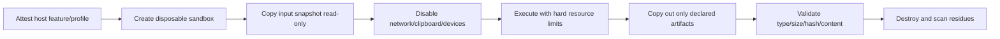

# Permissões e sandbox — capabilities e perfis verificáveis

**Estudo original:** 10 de agosto de 2026  
**Revisão:** 13 de agosto de 2026  
**Data de corte das fontes:** 13 de agosto de 2026  
**Versão:** 2.0  
**Status:** contrato documental; nenhum perfil de execução forte foi demonstrado  
**Método:** [Protocolo de pesquisa rigorosa](../planejamento/protocolo_pesquisa_rigorosa.md)  
**Base:** [Threat model v2](threat_model.md), [arquitetura](../arquitetura/arquitetura_de_referencia.md), [tarefas longas](../arquitetura/tarefas_longas_assincronas.md), [ciclo/ports](../ia/estado_e_ciclo_agentic.md), [RF](../produto/requisitos_funcionais.md), [RNF](../produto/requisitos_nao_funcionais.md) e [contratos v1](../../implementation/contracts/README.md)

## 1. Resultado da revisão

O texto original propunha RBAC + scopes genéricos como `shell:exec`, níveis N0–N4 e “Docker/devcontainer para MVP”. Scopes largos não vinculavam ação/alvo/limite; nível de autonomia misturava UX e autoridade; Docker, branch/worktree e aprovação eram apresentados como isolamento sem PoC.

Decisão:

> **o P0 não concede `shell:exec`. Ele concede uma capability imutável para uma operação tipada, tool/version, alvo canônico, limites, perfil e task/principal. O broker lógico é obrigatório em qualquer perfil, mas não é sandbox do SO. Processo no host sob o mesmo usuário é classificado como contenção fraca e não executa input hostil. Execução de código não confiável permanece negada até um ambiente virtualizado/copy-in–copy-out passar o corpus de isolamento.**

Permissão, aprovação, contenção, recuperabilidade e verificação são controles ortogonais. Nenhum substitui o outro.

## 2. Perguntas e claims

1. Qual sujeito pode executar exatamente qual operação, sobre qual recurso e por quanto tempo?
2. Qual controle é lógico, qual é aplicado pelo SO e qual é apenas detectivo?
3. Como filesystem, Git, processo, rede, secret e recurso são limitados por profile?
4. Como impedir path/link/TOCTOU, shell injection, hooks, child escape e environment leakage?
5. Qual perfil suporta apenas repo confiável e qual poderia receber fixture hostil?
6. Que evidência autoriza chamar um ambiente de isolado ou sandbox?

### Termos permitidos

| Termo | Evidência mínima |
|---|---|
| policy-enforced | decision e architecture tests mostram que o handler não inicia sem grant |
| workspace-scoped | corpus path/link/TOCTOU passa no SO/filesystem declarado |
| process-managed | árvore, timeout, output e survivors passam fault tests |
| network-denied | captura/negative tests provam ausência de egress no profile |
| secret-isolated | env/handles/sinks passam canary corpus |
| sandbox/isolated | boundary do SO/virtualização, adversarial tests e limitações publicadas |

Sem a evidência, o controle é `absent`, `logical-only` ou `degraded`; não “parcialmente seguro”.

## 3. Identidade e autoridade

### P0

- `principal_id` representa o usuário local e a sessão do host;
- o app não amplia privilégios, não usa admin/elevation e não pede `sudo`/UAC;
- processos rodam com conta menos privilegiada do profile; no perfil host básico, isso ainda é o usuário atual;
- provider identity/credential é separada da identidade do tool process;
- task/bundle/profile têm fingerprints imutáveis.

RBAC organizacional é P1/P2. No P0, papéis de governance são registrados, mas enforcement técnico usa principal + capabilities específicas. Host owner/admin permanece dentro do trust domain.

## 4. `CapabilityGrant`

| Campo | Regra |
|---|---|
| `grant_id`, schema/version | identidade única e contrato conhecido |
| principal/task/step | correspondem à task ativa |
| tool ID/version/definition fingerprint | resolução exata; alias não permitido |
| operation/effect class | ação tipada e classe não rebaixável |
| target selector | root/resource/relative path/destination normalizados |
| data classes | máximo permitido para read/input/output/egress |
| sandbox profile ID/fingerprint | controles efetivos, não nome amigável |
| limits | deadline, calls, bytes, processes, CPU/memory/disk/output |
| secret handles | lista mínima; vazia por default |
| network destinations | lista exata; vazia por default para tools |
| approval ref | obrigatório se policy decidir; action fingerprint igual |
| issued/expires/nonce/use count | TTL curto, uso máximo, consumo atômico |
| policy/bundle fingerprints | vínculo ao snapshot autorizado |

Um grant não é delegável, composable por união nem herdado por child sem regra do profile. Mudança de argumento material, path, executable, env, limite, profile, policy ou tool invalida o action fingerprint.

## 5. Efeito em vez de “nível de autonomia”

| Envelope | Exemplo | Autoridade |
|---|---|---|
| E0 observe | ler metadado/arquivo autorizado | policy allow + provenance |
| E1 propose | plano/diff sem aplicar | sem effect capability |
| E2 reversible local | escrever arquivo com snapshot/CAS | grant específico; approval conforme risco |
| E3 controlled execute | processo/teste no profile compatível | grant + resource/network/secret controls |
| E4 external/restricted | install, fetch, push, publish, cloud/database | ausente/deny P0 |
| E5 prohibited | escape, credential fora do scope, irreversível/produtivo | deny sem override P0 |

A UI pode automatizar mais passos E0/E1, mas isso não eleva autoridade. Um plano aprovado não concede E2/E3.

## 6. Perfis de contenção

| Perfil | Controles | Uso permitido | Não permite/claim |
|---|---|---|---|
| SBX-0 `logical-readonly` | broker, schema/policy/event; filesystem adapter read-only e provider | contexto, plano, relatório em repo autorizado | nenhum processo, write, secret, tool egress; não é sandbox de SO |
| SBX-1 `controlled-host` | SBX-0 + write CAS/snapshot; processo tipado e árvore/limites quando PoC | repo/fixtures confiáveis sob usuário local | input hostil, secret real, network-denied forte, escape resistance |
| SBX-2 `windows-virtualized` candidato | Windows Sandbox/VM, network/clipboard/device off, copy-in/out controlado, disposable | testes/código não confiável somente após PoC | não mapeia host write amplo; não promete proteção contra hypervisor/kernel flaw |
| SBX-3 `hardened-worker` futuro | VM/microVM/container hardening, identidade/attestation/egress/storage próprios | P1/P2/multi-tenant após threat model | não pertence ao P0 |

### Regra de promoção

- o primeiro vertical slice começa em SBX-0;
- writes locais podem usar subset SBX-1 após filesystem/Git tests;
- qualquer execução de código de repo requer SBX-1 somente se repo e dependências são confiáveis e network/secret residual foi aceito; caso contrário, SBX-2;
- fixture adversarial que tenta RCE/escape só roda em SBX-2/3 aprovado;
- se feature/edition/API necessária não existir, profile é `unavailable` e não degrada silenciosamente.

Windows Sandbox usa virtualização baseada em Hyper-V, mas configurações padrão habilitam rede e clipboard; mapped folder writable persiste efeitos no host ([S8], [S9]). Logo defaults não são aceitáveis. O candidato SBX-2 precisa configuração explícita e teste real.

Docker não é baseline. A documentação do Docker reconhece que capabilities/mounts default e falhas de kernel podem produzir isolamento incompleto ([S13]). Container só entra como profile com daemon/rootless, mounts, user namespace, capabilities, seccomp, egress e host avaliados.

## 7. Manifesto `SandboxProfile`

| Grupo | Campos obrigatórios |
|---|---|
| identidade | profile ID/version/fingerprint, OS build/edition, runtime versions |
| processo | account/token/integrity, job/process group, breakaway, child limit, timeout/grace |
| filesystem | input/output roots, read/write modes, link/reparse policy, quota, cleanup |
| network | enforcement mechanism, default, destination rules, DNS/loopback/internal behavior |
| secrets | available handles, injection channel, lifetime, child inheritance |
| resources | CPU, memory, process count, wall time, disk/output limits e enforcement |
| devices/UI | clipboard, vGPU, audio/video/printer, host IPC |
| lifecycle | create, attest, copy-in, execute, copy-out, teardown e residue scan |
| evidence | conformance suite/version, last test, pass/fail/degraded controls |

O report diferencia `configured`, `observed` e `enforced`. Configuração por arquivo não prova aplicação.

## 8. FilesystemPort

### Operações P0

- stat/list/read dentro do root e limites;
- create/write/patch por precondition e artifact reversível;
- delete/move overwrite ausentes ou approval específico após tests;
- nenhum raw arbitrary host path vindo do modelo.

### `AuthorizedPath`

| Campo | Regra |
|---|---|
| root ID + root identity | root previamente aberto/atestado, não string mutável |
| relative segments | sem vazio, `.`/`..`, NUL, drive/UNC/device namespace/ADS proibidos conforme Windows |
| expected type | file/directory/missing; mismatch bloqueia |
| link/reparse policy | default deny no path e ancestrais para mutação P0 |
| expected identity/hash | precondition contra troca/concurrent modification |
| operation | read/create/replace/delete/move exata |
| byte/mode limits | size/output/encoding/permissões declarados |

### Sequência

1. validar sintaxe e root grant;
2. caminhar ancestrais e detectar reparse/link conforme policy;
3. resolver identidade/real path e confirmar dentro do root;
4. abrir/operar pelo mecanismo mais resistente disponível;
5. revalidar identity/hash imediatamente antes de mutar;
6. para write, usar temp exclusivo no mesmo diretório, conteúdo/hash esperado e replace atômico quando suportado;
7. fsync/durabilidade conforme ADR, observar resultado e revalidar;
8. registrar before/after e residue.

`path.resolve`/`realpath` seguido de uma abertura por string ainda tem janela TOCTOU. Node puro pode não oferecer toda primitiva handle/reparse necessária no Windows; até a PoC fechar isso, claim é SBX-1/trusted input, não hostile-safe. Reparse points alteram semântica normal de filesystem e exigem tratamento especial ([S10], [S11]).

## 9. ProcessPort

### `AuthorizedProcessInvocation`

- executable ID + absolute path/hash/version resolvidos pelo catálogo;
- `argv[]` como strings, sem command string;
- cwd como `AuthorizedPath` directory;
- env construído de allowlist mínima e secret handles explícitos;
- stdin mode/bytes, stdout/stderr byte/time/spool limits;
- profile, network/secret/resource grants;
- task/step/attempt/effect IDs, deadline/cancel grace;
- expected exit/result contract.

### Regras P0

- `exec`/shell/pipeline/redirection/glob não existem na port;
- Node usa spawn/execFile sem shell para executáveis nativos; `.cmd`/`.bat` não são aceitos no perfil host básico;
- `PATH` não vem implicitamente do processo pai; executable já está resolvido;
- env começa de mapa explícito, dedup case-insensitive no Windows;
- `detached=false`, window oculta quando aplicável, stdio consumido com backpressure;
- process tree entra em Windows Job Object sem breakaway quando o helper/PoC existir;
- timeout/cancel fecha admissão, sinaliza/termina árvore, aguarda grace e enumera survivors;
- exit/close/output truncation e spawn error são estados distintos;
- `killed=true` ou cancel request não prova que processo/filhos terminaram.

Node documenta que `exec` usa shell e input com metacaracteres pode produzir execução arbitrária; `execFile` não usa shell por default ([S6]). Pipes têm capacidade limitada e podem bloquear se output não for consumido ([S6]). Job Objects gerenciam grupos/limites/terminação, mas segurança de processo precisa ser aplicada separadamente e breakaway altera cobertura ([S7]).

### Scripts/testes/package managers

- comando vindo de `package.json`, Makefile ou repo é conteúdo não confiável;
- package manager pode usar shell, lifecycle scripts e rede, mesmo se o launcher foi tipado;
- P0 SBX-1 só executa comandos de fixture previamente revisados, sem install/fetch e com dependências preparadas;
- repo real/desconhecido exige SBX-2 ou bloqueio;
- não se traduz automaticamente `npm test` para shell; tool definition específica declara runtime/entrypoint e riscos.

## 10. GitPort

Git é processo com configuração, hooks, helpers, filters, pager/editor e transporte; não é parser inerte.

### Allowlist P0 inicial

| Classe | Operações candidatas | Restrições |
|---|---|---|
| inspect | version, rev-parse, status porcelain v2 `-z` | repo/root atestado, output limitado |
| diff | diff/name/status sem external diff/textconv | paths autorizados, no pager |
| local recovery | snapshot/ref/restore por operação específica | preconditions, dirty baseline, approval quando overwrite |
| remote | fetch/pull/push/clone/submodule update | ausente/deny P0 |
| history rewrite | reset hard/clean/rebase/force | ausente/deny P0 |

### Ambiente/config

- git executable absoluto/versionado;
- `GIT_TERMINAL_PROMPT=0`; credential/askpass/SSH/proxy env não herdados;
- system/global config substituídos por arquivos neutros do profile; repo config auditada;
- hooks desabilitados por `core.hooksPath` neutro quando operação poderia dispará-los;
- pager/editor/external diff/textconv/filter/attributes que executem programa são desabilitados ou bloqueados;
- aliases e `-c` arbitrário não entram em argumentos do modelo;
- safe.directory é lista exata; nunca wildcard `*`;
- `.git` file/gitdir/worktree/submodule e ownership são resolvidos e precisam permanecer no escopo aprovado;
- protocolos/remotes não são chamados.

Git documenta que hooks são programas e o diretório pode ser alterado por `core.hooksPath` ([S12]); configuração global/sistema e variáveis podem alterar comportamento ([S14]). Portanto, reproduzir ambiente é parte da segurança.

## 11. NetworkPort e egress

### Canais separados

| Canal | P0 |
|---|---|
| Core → provider local | loopback endpoint exato, auth/bind verificados |
| Core → provider remoto | destination/port/TLS/proxy policy e package redigido |
| tool/process → rede | deny; sem profile que prove enforcement, processo incompatível é bloqueado |
| package manager/Git remote/browser/MCP | ausente |
| telemetry/update check | off por default ou destino separado explicitamente aprovado |

DNS, proxy, redirect, IPv4/IPv6, loopback, private/link-local e rebinding fazem parte do corpus. Allowlist de hostname sem resolução/conexão verificada não basta. Tool não herda API key/proxy/provider socket.

## 12. Secrets

- P0 padrão: nenhuma tool recebe secret;
- provider adapter pode resolver um handle próprio dentro do Core, nunca no ContextPackage;
- grant lista handle ID, consumer, operation, destination e TTL;
- preferir canal/API que não exponha em argv, cwd, arquivo ou output;
- env injection, se inevitável em fase futura, usa mapa mínimo, processo isolado e cleanup/scan;
- child/descendant não herda por default;
- redaction ocorre antes de event/artifact/error/report, com fail-closed;
- value nunca aparece em approval/diff/log.

O secret literal encontrado durante esta revisão permanece incidente de rotação, conforme [threat model](threat_model.md#11-secrets-e-incidente-documental).

## 13. Approval e HITL

Approval screen precisa exibir sem interpretação do modelo:

- tool/operation/effect/risk e reason da policy;
- alvo canônico e paths/resources afetados;
- diff/argv/env variable names/network destinations/secret handle names;
- profile e controles ausentes/degradados;
- limites e reversibilidade/compensação;
- bundle/policy/plan/action fingerprints;
- principal, nonce, uso máximo e expiração.

Approve/reject/timeout são eventos. Alteração posterior invalida. Approval não torna code hostil seguro, não amplia sandbox, não autoriza retry de effect ambiguous e não satisfaz verifier.

## 14. Lifecycle SBX-2 candidato

Mapped host folder writable não é workspace isolation. O desenho preferido exporta patch/artifacts para staging dedicado, valida-os no Core e só então aplica por FilesystemPort com nova policy/precondition. Se Windows Sandbox CLI/edition não permitir lifecycle automatizável e atestável, usar VM alternativa ou manter execução hostil negada.

## 15. Conformance report

Cada execução registra:

- profile/bundle/OS build/runtime/tool versions;
- control matrix `enforced|logical-only|degraded|absent|not-applicable`;
- principal/integrity/token e admin/elevation false;
- roots/mounts/reparse policy;
- network observation/enforcement and destinations;
- secret handles/environment variable names, nunca values;
- process/resource limits e actual peaks;
- copy-in/out artifacts e validation;
- teardown/survivors/residues;
- conformance suite/version/date.

Release não aceita `degraded` para controle exigido pela fixture/risk class.

## 16. Hipóteses e testes

| ID | Hipótese | Teste | Refutação |
|---|---|---|---|
| SBX-H01 | grant não pode ser ampliado/reutilizado | mutate task/tool/target/limit/profile/TTL/nonce | handler inicia |
| SBX-H02 | SBX-0 não tem caminho de effect | import/API/fuzz | adapter mutante é alcançável |
| SBX-H03 | FilesystemPort contém path no Windows | reparse/link/race corpus | acesso fora do root ou overwrite concorrente |
| SBX-H04 | ProcessPort não usa shell/herança | metachar/env/PATH fixtures | sintaxe executa ou secret aparece |
| SBX-H05 | Job Object contém árvore | child/grandchild/breakaway/crash | survivor não detectado |
| SBX-H06 | GitPort neutraliza executable behavior | hook/filter/alias/helper/editor fixtures | programa externo inicia |
| SBX-H07 | tool egress é zero no profile | IPv4/6/DNS/proxy/redirect corpus | conexão não autorizada |
| SBX-H08 | SBX-2 não persiste host effects | mapped/copy-out/clipboard/device tests | effect fora de staging ou residue oculto |

## 17. Testes de aceitação

| ID | Teste | Aceite |
|---|---|---|
| SBX-T01 | CapabilityGrant schema/fingerprint | mudança material invalida; unknown deny |
| SBX-T02 | consume/expiry/race | uso máximo atômico; replay rejeitado |
| SBX-T03 | profile attestation | controle configurado mas não observado não conta enforced |
| SBX-T04 | Windows path syntax | drive/UNC/device/ADS/traversal/case tratados |
| SBX-T05 | reparse/link/mount corpus | zero escape/loop; policy default deny |
| SBX-T06 | TOCTOU/dirty write | CAS conflict; nenhuma perda fora do scope |
| SBX-T07 | process argv/shell | no exec/cmd/bat; metachar literal/inválido |
| SBX-T08 | env/PATH/secret | somente allowlist e zero canary |
| SBX-T09 | output/time/resource | no deadlock/OOM; truncation/status corretos |
| SBX-T10 | process tree/cancel/crash | descendants finalizados ou residue explícito |
| SBX-T11 | Git hook/filter/config/helper | zero subprocess externo não autorizado |
| SBX-T12 | Git remote/history destructive | operação ausente/deny antes de Git |
| SBX-T13 | network matrix | provider-only destination; tool zero |
| SBX-T14 | Windows Sandbox defaults | custom profile prova network/clipboard/vGPU/input/mapping states |
| SBX-T15 | copy-out validation | só artifacts declarados, size/type/hash/redaction válidos |
| SBX-T16 | teardown/reuse | ambiente descartado e nenhuma cross-task state |

## 18. Decisões e questões abertas

| ID | Decisão | Estado |
|---|---|---|
| SBX-D01 | broker lógico não é sandbox de SO | aceita |
| SBX-D02 | sem scope genérico `shell:exec` | aceita |
| SBX-D03 | SBX-0 é baseline; SBX-1 só trusted input | aceita |
| SBX-D04 | code hostil exige SBX-2/3 comprovado | aceita |
| SBX-D05 | Docker/devcontainer não é default | aceita |
| SBX-D06 | shell/cmd/bat e Git remote ausentes P0 | aceita |
| SBX-D07 | tool network e secrets são zero por default | aceita |
| SBX-D08 | Windows é primeiro alvo, claim limitado por build/edition | aceita via ADR-001; PoC pendente |

| ID | Questão | Método | Bloqueia |
|---|---|---|---|
| OD-SBX-01 | Windows build/edition, Sandbox/Hyper-V/`wsb` disponíveis | read-only probe + PoC | SBX-2 |
| OD-SBX-02 | helper nativo/Job Object e packaging | spike + SBX-T10 | process management claim |
| OD-SBX-03 | primitive handle/reparse/atomic write em Node/Windows | spike nativo + corpus | hostile filesystem claim |
| OD-SBX-04 | comandos/test runners exatos | manifests UC + review | SBX-1 catalog |
| OD-SBX-05 | egress enforcement por profile | Windows Sandbox/network capture | process execution P0 |
| OD-SBX-06 | artifact staging/copy-out protocol | lifecycle fechado por ADR-009; PoC ainda necessária | SBX-2 writes |
| OD-SBX-07 | storage/root/quota/cleanup paths | protocolo/limites obrigatórios definidos; valores MP-P0 pendentes | implementation |

Atualização de implementação em 13/08/2026: ADR-012, SandboxProfile e CapabilityGrant fecham a forma de seleção/vínculo; isso não prova enforcement. OD-SBX-01–05 e a PoC de copy-out continuam bloqueando qualquer claim de isolamento forte.

## 19. Registro de evidências

| ID | Classe | Afirmação delimitada | Fonte | Confiança | Impacto |
|---|---|---|---|---|---|
| SBX-C01 | fato de plataforma | Windows Sandbox usa virtualização; defaults incluem rede/clipboard e mappings writable persistem no host | [S8], [S9] | alta | custom SBX-2 obrigatório |
| SBX-C02 | fato de plataforma | Job Objects agrupam/limitam/terminam processos, com breakaway e limites de segurança separados | [S7] | alta | process management, não sandbox forte |
| SBX-C03 | fato de runtime | Node exec usa shell; execFile não por default; env/output exigem configuração | [S6] | alta | ProcessPort tipada |
| SBX-C04 | fato de plataforma | reparse points alteram comportamento de filesystem e requerem manejo especial | [S10], [S11] | alta | corpus/adapter Windows |
| SBX-C05 | fato de software | Git hooks/config/environment podem executar/alterar comportamento | [S12], [S14] | alta | GitPort hermética |
| SBX-C06 | fato de fornecedor | Docker alerta para capabilities/mounts/kernel como riscos de isolamento incompleto | [S13] | alta | container não presumido seguro |
| SBX-C07 | desconhecido | disponibilidade/eficácia de SBX-1/2 neste host | OD-SBX-01–07 | baixa | execução continua bloqueada por profile |

## 20. Fontes e busca

- **[S1]** ACI Arena. [Threat model v2](threat_model.md). 13 ago. 2026.
- **[S2]** ACI Arena. [Arquitetura de referência](../arquitetura/arquitetura_de_referencia.md). Revisão de 12 ago. 2026.
- **[S3]** ACI Arena. [Tarefas longas](../arquitetura/tarefas_longas_assincronas.md). Revisão de 12 ago. 2026.
- **[S4]** ACI Arena. [Ciclo agentic/ports](../ia/estado_e_ciclo_agentic.md). 13 ago. 2026.
- **[S5]** ACI Arena. [Contratos v1](../../implementation/contracts/README.md). 13 ago. 2026.
- **[S6]** Node.js. [Child process — v24.16.0](https://nodejs.org/download/release/v24.16.0/docs/api/child_process.html). Consulta em 13 ago. 2026.
- **[S7]** Microsoft. [Job Objects](https://learn.microsoft.com/en-us/windows/win32/procthread/job-objects). Atualizado em 14 jul. 2025; consulta em 13 ago. 2026.
- **[S8]** Microsoft. [Application isolation — AppContainer e Windows Sandbox](https://learn.microsoft.com/en-us/windows/security/book/application-security-application-isolation). Consulta em 13 ago. 2026.
- **[S9]** Microsoft. [Use and configure Windows Sandbox](https://learn.microsoft.com/en-us/windows/security/application-security/application-isolation/windows-sandbox/windows-sandbox-configure-using-wsb-file). Consulta em 13 ago. 2026.
- **[S10]** Microsoft. [Reparse Points](https://learn.microsoft.com/en-us/windows/win32/fileio/reparse-points). Consulta em 13 ago. 2026.
- **[S11]** Microsoft. [Reparse Points and File Operations](https://learn.microsoft.com/en-us/windows/win32/fileio/reparse-points-and-file-operations). Consulta em 13 ago. 2026.
- **[S12]** Git. [githooks](https://git-scm.com/docs/githooks). Consulta em 13 ago. 2026.
- **[S13]** Docker. [Docker Engine security](https://docs.docker.com/engine/security/). Consulta em 13 ago. 2026.
- **[S14]** Git. [git-config](https://git-scm.com/docs/git-config). Consulta em 13 ago. 2026; fixar versão do Git ao implementar.

**Busca executada em 13/08/2026:** documentação oficial Node 24.16, Windows AppContainer/Sandbox/Job Objects/reparse points, Git hooks/config e Docker security. Foram excluídos tutoriais de “sandbox em JavaScript” e claims genéricos de container security.

## 21. Critério de encerramento

A revisão documental está encerrada porque capabilities, profiles, filesystem/process/Git/network/secret ports, approval, lifecycle, conformance, hipóteses e testes estão explícitos. Nenhum profile de execução está validado até SBX-T01–16 passarem no host/build/runtime escolhido.

O estudo autoriza implementar SBX-0, schemas/grants, mocks e probes read-only; SBX-1 pode ser preparado para fixtures confiáveis. Não autoriza executar código hostil, secret real, network tool, package install, Git remote, produção, ou declarar Job Object/Docker/worktree/Windows Sandbox default como isolamento suficiente.
