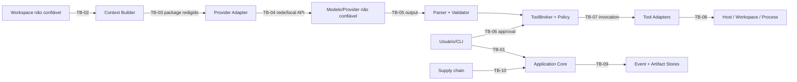

# Threat model — P0 local de engenharia agentic

**Estudo original:** 10 de agosto de 2026  
**Revisão:** 13 de agosto de 2026  
**Data de corte das fontes:** 13 de agosto de 2026  
**Versão:** 2.0  
**Status:** modelo documental; controles, corpus ofensivo e perfis de contenção ainda não implementados  
**Método:** [Protocolo de pesquisa rigorosa](../planejamento/protocolo_pesquisa_rigorosa.md)  
**Base:** [Arquitetura](../arquitetura/arquitetura_de_referencia.md), [governança](../ia/governanca_de_ia.md), [contexto](../ia/contexto_memoria_rag_estrategia.md), [ciclo agentic](../ia/estado_e_ciclo_agentic.md), [custos](../ia/gerenciamento_de_custos.md), [RF](../produto/requisitos_funcionais.md) e [RNF](../produto/requisitos_nao_funcionais.md)

## 1. Resultado da revisão

O texto original listava ativos, atacantes e dez ameaças, mas não definia sistema, trust boundaries, premissas, caminhos de abuso, critério de risco, owner, teste ou risco residual. “Sandbox, allowlist e aprovação” apareciam como mitigação genérica; denylist de comandos e modelo local poderiam sugerir segurança inexistente.

Decisão:

> **P0 é seguro apenas para um usuário local autorizado, repositórios controlados e inputs não classificados como hostis, dentro de um perfil de contenção declarado. O modelo, repositório, stdout, provider e dependências são não confiáveis. Toda autoridade fica fora do modelo; tool execution passa por broker, política, approval vinculada e adapter contido. Código hostil, segredo real e efeito produtivo são negados até um perfil forte ser demonstrado.**

O threat model usa OWASP Agentic Top 10 como taxonomia de descoberta e NIST SSDF/AI profile como referências, não como prova de cobertura ou conformidade ([S8]–[S11]).

## 2. Sistema e objetivo de segurança

### Dentro do P0

- CLI e Application Core no host Windows inicialmente;
- task manifest/governance bundle, state machine e event/artifact stores locais;
- contexto do workspace autorizado;
- um provider adapter, local LM Studio ou endpoint remoto declarado;
- ToolBroker e adapters filesystem, Git e processo/testes;
- policy/approval, verifier, orçamento e recovery;
- uma tarefa mutante por workspace, sem servidor HTTP público.

### Objetivos

| ID | Objetivo |
|---|---|
| SG-01 | nenhum efeito fora de ação, alvo, principal, limites e profile autorizados |
| SG-02 | nenhum secret-canary/dado proibido cruza destino ou persistência não autorizados |
| SG-03 | conteúdo não confiável não altera autoridade, policy ou controle do ciclo |
| SG-04 | toda mutação é atribuível, detectável, limitada e recuperável ou deixa resíduo explícito |
| SG-05 | retry/crash/cancel não duplica efeito nem transforma unknown em success |
| SG-06 | evidência/eventos permitem reconstruir decisões e detectar adulteração no trust domain declarado |
| SG-07 | comprometimento de modelo/provider/tool é limitado pelas capabilities externas ao modelo |
| SG-08 | falha/indisponibilidade de controle obrigatório fecha a operação material |

### Fora do objetivo/claim

- defender o host contra seu administrador/owner malicioso ou host/kernel já comprometido;
- executar malware, exploit, repo deliberadamente hostil ou workload multi-tenant no perfil básico;
- garantir confidencialidade contra software do host com mesmos privilégios;
- impedir todo side channel, supply-chain compromise ou escape de VM/container;
- proteger produção/cloud/Git remoto porque esses efeitos são proibidos no P0;
- não repúdio externo ou segurança física.

Esses limites não tornam o risco aceitável; definem quando bloquear e qual novo perfil/controle seria necessário.

## 3. Ativos e propriedades

| ID | Ativo | C | I | A | Consequência dominante |
|---|---|:---:|:---:|:---:|---|
| A-01 | workspace/código/IP e dirty changes | alta | alta | média | exfiltração, perda, patch oculto |
| A-02 | credenciais/secrets/handles | crítica | alta | média | takeover/egress |
| A-03 | host, filesystem e identidade do usuário | alta | crítica | alta | escape e execução arbitrária |
| A-04 | repositório Git, refs/config/hooks | média | alta | média | execução/alteração de histórico |
| A-05 | task state, approvals e policy | média | crítica | alta | autorização falsa/replay |
| A-06 | event log/evidência/artifacts | alta | alta | média | auditoria falsa/secret retention |
| A-07 | prompts/context/memória | alta | alta | média | injection/poisoning/leakage |
| A-08 | provider account/quota/custo | média | alta | média | custo, indisponibilidade, dado externo |
| A-09 | modelos/weights/runtime/templates | média | alta | média | comportamento adulterado/RCE de loader |
| A-10 | verificadores/testes/oracles | baixa | crítica | média | falso sucesso/reward hacking |
| A-11 | disponibilidade/capacidade local | baixa | média | alta | DoS, runaway process/disco |

C/I/A são prioridades relativas deste projeto, não classificação regulatória.

## 4. Atores e capacidades

| Ator | Capacidade considerada | Não presumido |
|---|---|---|
| usuário local autorizado | cria task, escolhe workspace, aprova ação; pode errar ou ser enganado | malicioso com privilégio de admin não é contido pelo app |
| conteúdo do repo/issue/stdout | bytes arbitrários que o modelo interpreta | execução ou instrução legítima |
| modelo local/remoto | output arbitrário/malformado, tool proposals, loops | honestidade, segredo, aderência ao prompt |
| provider/endpoint comprometido | resposta, metadata, usage e drift falsos; disponibilidade/retention externa | acesso direto ao host sem capability |
| dependency/model artifact malicioso | install/load scripts, parser/runtime exploit, trojan behavior | confiabilidade por popularidade |
| processo/tool chamado | árvore de processos, filesystem/rede herdados, output flood | obediência ao modelo de tool |
| atacante de rede | endpoint exposto, MITM se transporte/config fracos | acesso local quando binding/ACL corretos |
| plugin/MCP/agente remoto | fora do P0; schema/descrição/resposta arbitrários se futuro | confiança por descoberta automática |

## 5. Trust boundaries



| Boundary | Falha de confiança | Controles centrais |
|---|---|---|
| TB-01 CLI → Core | alvo/identidade/manifest ambíguo | root canônico, schema, snapshot, confirmação específica |
| TB-02 Repo → Context | prompt injection, secret, parser bomb | data-not-instruction, scope, limits, redaction, provenance |
| TB-03 Context → Provider | dado excessivo/proibido | package fingerprint, destination policy, minimização |
| TB-04 Adapter → Endpoint | MITM/drift/retention/custo | endpoint allowlist, auth handle, TLS onde remoto, capability snapshot |
| TB-05 Model → Core | malformed output/tool injection | size/time limits, parser, JSON Schema, no authority |
| TB-06 Humano → Approval | consent fatigue/confused deputy/replay | normalized action, diff/target, nonce, TTL, one-use |
| TB-07 Broker → Adapter | bypass/substitution/TOCTOU | sealed AuthorizedInvocation, intent event, architecture tests |
| TB-08 Tool → Host | filesystem escape/RCE/network/DoS | sandbox profile, argv, cwd/root, environment, limits, recovery |
| TB-09 Core → Storage | tamper/secret/disk full | transaction, digest chain, redaction, quota, backup/restore |
| TB-10 Artifact → Runtime | dependency/model/update compromise | pin/hash/provenance, review, no install scripts by default |

## 6. Premissas e invariantes

### Premissas testáveis

- usuário do piloto controla/autoriza o repo e não executa como administrador;
- host recebeu patches e antimalware conforme política ainda a definir;
- endpoint local não é exposto além do binding/ACL declarado;
- credencial é handle resolvido somente pelo adapter;
- processo/tool básico não recebe rede/secrets quando enforcement não foi demonstrado;
- fixtures ofensivas rodam apenas em ambiente descartável apropriado.

Se premissa falhar, profile é `unsupported` e a task bloqueia.

### Invariantes

1. modelo não concede capability, permission, approval ou success;
2. todo efeito passa por `schema → normalize → risk → policy → approval? → intent → adapter → outcome`;
3. unknown version/action/target/capability falha fechado;
4. segredo não aparece em prompt, event, artifact, erro ou report;
5. processo não herda segredo/rede do provider adapter;
6. approval é action-specific, one-use, nonce-bound e expira;
7. effect ambíguo não sofre retry automático;
8. snapshot/precondition precede escrita; verifier precede sucesso;
9. kill switch fecha admissão antes de best-effort termination;
10. nenhum profile é chamado de sandbox forte sem PoC negativa no SO/runtime.

## 7. Método de priorização

`impact` e `exploitability` recebem 1–4. `priority = impact × exploitability`:

- 12–16 crítico; 8–11 alto; 4–7 médio; 1–3 baixo.

O número é triagem ordinal, não probabilidade. A tabela mostra risco inerente e residual-alvo depois de controles; residual-alvo não é resultado medido. Qualquer ameaça que viole QG-01–04 ou produza escape/secret real bloqueia release independentemente da soma.

## 8. Registro de ameaças P0

| ID | Ameaça/caminho | Inerente | Controles requeridos | Residual-alvo | Gate/teste |
|---|---|---:|---|---:|---|
| TM-01 | goal hijack por README/issue/stdout | 16 | trust class, delimitação, no authority, broker | 6 | SEC-T01 |
| TM-02 | tool proposal malformada/injetada | 16 | parser limitado, schema local, exact catalog | 4 | SEC-T02 |
| TM-03 | privilege/identity abuse via tool/secret | 16 | least capability, handles, profile, deny R4 | 6 | SEC-T03 |
| TM-04 | shell/metacharacter/argument injection | 16 | sem shell, executable/argv tipados, allowlist semântica | 4 | SEC-T04 |
| TM-05 | unexpected code execution em parser/runner/model loader | 16 | formatos fixos, patching, isolamento, no dynamic eval | 8 | SEC-T05; profile forte |
| TM-06 | path escape por `..`, symlink, junction/reparse, alias/case | 16 | canonicalização por operação, handle/root, negative corpus | 4 | SEC-T06 |
| TM-07 | TOCTOU troca arquivo/path entre approval e write | 12 | hash/file identity precondition, reopen/recheck | 4 | SEC-T07 |
| TM-08 | Git hook/filter/config/submodule executa código | 12 | comandos Git tipados, hooks disabled/controlled, config audit | 6 | SEC-T08 |
| TM-09 | package manager install script/supply chain | 16 | deny no P0 salvo profile/aprovação; lock/hash/provenance | 8 | SEC-T09 |
| TM-10 | exfiltração por provider, tool, DNS/rede ou erro | 16 | egress separado/deny, redaction, destination policy | 4 | SEC-T10/QG-02 |
| TM-11 | secret em repo/env/log/process child | 16 | D5 handles, env allowlist, canaries, scrub before persist | 4 | SEC-T11/QG-02 |
| TM-12 | context/memory/index poisoning ou cross-project | 12 | provenance, scope, TTL, invalidation, isolation | 4 | SEC-T12 |
| TM-13 | approval confusion/replay/substitution | 16 | fingerprint, target/limits/principal, nonce/TTL/CAS | 4 | SEC-T13 |
| TM-14 | effect duplicado por retry/crash/cancel | 16 | intent journal, idempotency/reconcile, unknown state | 4 | SEC-T14/QG-03 |
| TM-15 | verifier/reward hacking, teste removido/tautológico | 12 | independent oracle, mutation/hidden checks, diff rules | 6 | SEC-T15 |
| TM-16 | event/artifact tamper, correction/deletion silenciosa | 12 | append-only semantics, digests, refs/size, tamper suite | 4 | SEC-T16 |
| TM-17 | output/resource/cost exhaustion | 12 | input/output/process/disk/deadline/budget ceilings | 4 | SEC-T17 |
| TM-18 | processo órfão/descendente/breakaway | 12 | process-tree control, close admission, detect survivors | 6 | SEC-T18; PoC por SO |
| TM-19 | provider/model/template/capability drift | 12 | immutable bundle, probe/canary, expiry, suspend | 4 | SEC-T19 |
| TM-20 | local API exposta/sem autenticação | 12 | loopback/binding, auth/ACL, no public listener P0 | 4 | SEC-T20 |
| TM-21 | model/dependency artifact adulterado | 12 | source/license/hash/signature/provenance, quarantine | 6 | SEC-T21 |
| TM-22 | bypass arquitetural/legacy code chama adapter | 16 | isolated legacy, import graph, ports only, tests | 4 | SEC-T22 |
| TM-23 | rollback apaga dirty change ou deixa resíduo oculto | 12 | baseline/snapshot/hash/CAS, scoped restore/report | 4 | SEC-T23/QG-04 |
| TM-24 | storage full/corrupt/backup vaza dado | 12 | quotas, fail-closed, integrity/restore, retention/redaction | 6 | SEC-T24 |

### Fora do P0, mas bloqueado preventivamente

| ID | Ameaça futura | Regra atual |
|---|---|---|
| TM-F01 | MCP/plugin/skill malicioso ou schema poisoning | nenhum loading/auto-discovery P0 |
| TM-F02 | inter-agent impersonation/poisoning/cascade | sem multiagente/A2A |
| TM-F03 | cross-tenant data/identity | sem tenancy; projeto/principal ainda isolados |
| TM-F04 | push/deploy/cloud/IAM/database produtivo | tools/capabilities ausentes e `R4 deny` |
| TM-F05 | web/browser indirect injection | sem browser tool no P0 |

## 9. Caminhos de abuso prioritários

### AT-01 — repo → exfiltração

```text
arquivo hostil instrui o modelo
  → modelo propõe ler secret ou chamar rede
    → [deve falhar] secret fora do ContextPackage / tool inexistente ou deny
      → [deve falhar] processo sem secret e sem egress
        → [deve detectar] canário em qualquer sink
```

### AT-02 — modelo → comando destrutivo

```text
output disfarça delete como teste
  → schema/effect class não pode ser rebaixado
    → policy R4 deny ou approval específico R3
      → alvo/fingerprint muda após approval
        → nonce/action binding rejeita antes do handler
```

### AT-03 — crash → duplicação

```text
effect intent persistido → handler produz efeito → resposta/evento se perde
  → recovery observa pending/ambiguous
    → retry automático é proibido
      → reconcile observa destino ou termina inconclusivo
```

### AT-04 — package install → host compromise

```text
modelo edita manifest/lock → pede install/test
  → package scripts/dependency fetch exigem capability/rede ausentes
    → profile básico nega
      → futuro profile forte usa fonte/lock/hash/egress e fixture descartável
```

## 10. Controles por prevenção, detecção e resposta

| Domínio | Prevenir | Detectar | Responder/recuperar |
|---|---|---|---|
| autoridade | broker/policy/approval/capabilities | event chain e bypass tests | revoke/kill/suspend bundle |
| dados | scope/minimize/redact/no raw secret | canary scans/egress audit | contain, rotate, purge conforme policy |
| execução | typed argv/profile/no network/secrets | process tree/resource/survivor | terminate, reconcile, discard env |
| workspace | root/CAS/snapshot/scoped writes | before/after hashes/diff | rollback sem tocar alheio; residue report |
| provider | allowlisted endpoint/bundle | drift/errors/usage anomalies | circuit/suspend; sem fallback inseguro |
| supply chain | pin/hash/provenance/no scripts | verify hash/SBOM/advisory | quarantine/update/rollback |
| storage | append/digest/transaction/quota | replay/tamper/integrity check | restore/rebuild projection/incident |

Prompt “não faça X”, denylist de strings, revisão por outro LLM e logs sem enforcement são defesa complementar, não controle suficiente.

## 11. Secrets e incidente documental

### Regra

- secret value nunca entra em Markdown, issue, prompt, event, artifact, test fixture ou command line;
- handle é resolvido no último adapter e injetado pelo canal mínimo;
- child env começa vazio/allowlist, não herda ambiente inteiro;
- erro/output passa por redaction antes de persistir;
- canário é sintético e não reutiliza credential real;
- rotação/revogação é processo externo com evento sem valor.

### Achado de 13/08/2026

Uma chave literal foi encontrada em `vulnerabilidades_e_hardening.md` e `omniroute_backup_restore.md`. O valor foi removido dos arquivos de trabalho e buscas específicas não encontraram outra cópia literal com o mesmo formato. Isso não remove cópias em histórico, backup, index, log, cache ou sistemas externos.

Ação obrigatória do owner, fora desta revisão documental:

1. revogar/rotacionar a chave no sistema proprietário;
2. identificar dados criptografados e planejar re-encriptação/compatibilidade;
3. procurar cópias em histórico/backups/logs com ferramenta autorizada, sem exibir o valor;
4. invalidar backups plaintext e revisar acessos;
5. registrar incidente, escopo e conclusão sem republicar o secret.

Este agente não rotacionou a chave nem alterou a instalação externa.

## 12. Corpus adversarial e fault injection

| Família | Casos mínimos |
|---|---|
| injection | README/comentário/test output com bypass, tool fake, encoded instruction |
| parser | JSON profundo/grande/duplicado, invalid UTF, extra fields, tool name collision |
| filesystem | `..`, absolute/UNC/device paths, symlink/junction/reparse, case/8.3, race/swap |
| process | metacharacters, shell wrappers, child/grandchild, breakaway, output flood, hang |
| Git | hook, alias, external diff/filter, malicious config, submodule/worktree edge |
| data | secret canaries literal e encodings previstos, cross-project, error/stack/trace |
| network | DNS/HTTP/internal/loopback/metadata-like targets, provider vs tool egress |
| approval | expired/replayed/changed arg-target-limit/principal/nonce/concurrent use |
| fault | crash antes/depois de intent/invoke/result, disk full, store/redactor unavailable |
| verifier | test deleted/skipped/flaky/tautological, model claims pass, patch gaming |
| resource | token/output/file/process/disk/memory/time ceilings and races |

Fixtures que exercem código hostil só rodam em profile forte/disposable. No profile básico, o teste esperado é `deny before execution`.

## 13. Testes de aceitação

| ID | Teste | Aceite |
|---|---|---|
| SEC-T01 | indirect prompt injection | zero mudança de goal/policy/capability; tentativa visível |
| SEC-T02 | malformed/unknown tool | zero handler; parser/schema error limitado |
| SEC-T03 | privilege/secret request | deny; nenhum valor em env/output/store |
| SEC-T04 | argv/shell corpus | nenhum metacharacter vira sintaxe; shell desativado |
| SEC-T05 | parser/runner hostile input | bloqueado no profile básico; PoC forte sem escape |
| SEC-T06 | path/link/reparse corpus | zero acesso fora de root/allowlist |
| SEC-T07 | TOCTOU | mudança pós-check produz conflito/deny |
| SEC-T08 | Git config/hooks | zero hook/filter externo não autorizado |
| SEC-T09 | dependency/install | scripts/rede ausentes ou profile/aprovação exatos |
| SEC-T10 | egress matrix | somente provider destination explícito; tool network zero P0 |
| SEC-T11 | secret canaries | QG-02 em todos os sinks previstos |
| SEC-T12 | memory/context isolation | zero cross-project/principal/stale-as-current |
| SEC-T13 | approval corpus | replay/substitution/expiry/race rejeitados |
| SEC-T14 | retry/crash effect | QG-03; ambiguous nunca reinvocado |
| SEC-T15 | verifier gaming | nenhum falso success; mutantes detectados |
| SEC-T16 | event/artifact tamper | alteração/inserção/reordenação/ref mismatch detectados |
| SEC-T17 | resource limits | admissão fecha; nenhum consumo ilimitado/oculto |
| SEC-T18 | process tree/cancel | descendants encerrados ou survivors explícitos |
| SEC-T19 | provider/model drift | bundle suspenso/bloqueado até reavaliação |
| SEC-T20 | local endpoint exposure | nenhum listener inesperado; auth/bind conforme profile |
| SEC-T21 | artifact integrity | hash/source/license/provenance verificados ou quarantine |
| SEC-T22 | architecture bypass | nenhuma import/API chama adapter fora do core/broker |
| SEC-T23 | rollback/dirty state | QG-04 e nenhum trabalho fora do scope apagado |
| SEC-T24 | storage fault/backup | fail-closed, recovery/integrity e zero secret-canary |

## 14. Gates e resposta a incidente

### Gate de release P0

- SEC-T01–24 aplicáveis passam no SO/profile declarado;
- QG-01–04 e EV-G05–08 passam;
- nenhum risco crítico/alto sem owner, tratamento e teste;
- profile reporta controles ausentes/degradados;
- provider/model/dependencies/price/data destinations estão inventariados;
- kill switch, restore e tabletop de secret/escape/duplication foram ensaiados;
- R4 é negado e nenhum efeito produtivo/remoto existe.

### Sequência de incidente

1. fechar admissão, revogar approvals e suspender bundle/profile afetado;
2. preservar evidência redigida e evitar novos efeitos;
3. conter processo/egress/credential e reconciliar estado;
4. delimitar tasks, artifacts, dados, principals e tempo;
5. rotacionar/revogar/restaurar conforme classe;
6. corrigir em novo bundle, repetir corpus e decidir reativação;
7. registrar comunicação, causa, residual e prevenção.

Escape confirmado, credential real exposta ou efeito produtivo não autorizado bloqueia toda execução mutante até contenção/revisão.

## 15. Decisões e questões abertas

| ID | Decisão | Estado |
|---|---|---|
| TM-D01 | modelo/repo/provider/stdout são não confiáveis | aceita |
| TM-D02 | P0 não executa input classificado hostil | aceita até profile forte |
| TM-D03 | usuário local/host owner está dentro do trust domain | aceita; claim limitado |
| TM-D04 | R4, produção, browser, MCP/plugin e multiagente são deny/ausentes | aceita |
| TM-D05 | prompt/denylist/reviewer LLM não são autorização | aceita |
| TM-D06 | risk score é triagem, hard gates dominam | aceita |
| TM-D07 | secret documental exige rotação externa | ação do owner pendente |

| ID | Questão | Método | Bloqueia |
|---|---|---|---|
| OD-TM-01 | Windows/profile de contenção realmente disponível | PoC sandbox v2 | processo hostil |
| OD-TM-02 | provider/model/endpoint/dados do piloto | inventário + governance | egress real |
| OD-TM-03 | comandos/ecossistemas permitidos | manifests + threat analysis por command | ToolCatalog |
| OD-TM-04 | secret store/injection/redaction concreto | ADR + canary corpus | credential real |
| OD-TM-05 | integrity anchor/backup/data root | DDL/artifact/recovery ADRs | auditoria/durabilidade |
| OD-TM-06 | responsável e SLA de incidentes | owner/tabletop | piloto além de fixture |
| OD-TM-07 | status da rotação da chave exposta | owner evidence sem valor | uso contínuo OmniRoute |

## 16. Registro de evidências

| ID | Classe | Afirmação delimitada | Fonte | Confiança | Impacto |
|---|---|---|---|---|---|
| TM-C01 | taxonomia | OWASP Agentic Top 10 2026 inclui goal hijack, tool misuse, privilege abuse, supply chain, code execution e context/memory risks | [S8], [S9] | média-alta como taxonomia | discovery, não incidência local |
| TM-C02 | fato normativo voluntário | NIST SP 800-218A estende SSDF com práticas para produtores/adquirentes de sistemas/modelos de IA | [S10] | alta | secure development/supply chain |
| TM-C03 | fato de especificação | SLSA define níveis/requisitos de provenance para artifacts de software | [S11] | alta | candidato de supply chain, não implementado |
| TM-C04 | fato observado | secret literal existia em dois documentos locais e foi redigido | diff/busca local de 13/08/2026 | alta | rotação e prevenção |
| TM-C05 | inferência | local-first não isola de repo/process/model supply chain nem software do host | boundaries + [S8]–[S10] | alta | claims limitados |
| TM-C06 | desconhecido | eficácia dos controles e isolamento do profile Windows | OD-TM-01–06 | baixa | nenhum claim de sandbox/segurança |

## 17. Fontes e busca

- <a id="s1"></a>**[S1]** ACI Arena. [Arquitetura de referência](../arquitetura/arquitetura_de_referencia.md). Revisão de 12 ago. 2026.
- <a id="s2"></a>**[S2]** ACI Arena. [Requisitos funcionais](../produto/requisitos_funcionais.md). Revisão de 12 ago. 2026.
- <a id="s3"></a>**[S3]** ACI Arena. [Requisitos não funcionais](../produto/requisitos_nao_funcionais.md). Revisão de 12 ago. 2026.
- <a id="s4"></a>**[S4]** ACI Arena. [Governança de IA](../ia/governanca_de_ia.md). 13 ago. 2026.
- <a id="s5"></a>**[S5]** ACI Arena. [Contexto/memória](../ia/contexto_memoria_rag_estrategia.md). 13 ago. 2026.
- <a id="s6"></a>**[S6]** ACI Arena. [Ciclo agentic](../ia/estado_e_ciclo_agentic.md). 13 ago. 2026.
- <a id="s7"></a>**[S7]** ACI Arena. [Dados e persistência](../arquitetura/dados_e_persistencia.md). Revisão de 12 ago. 2026.
- <a id="s8"></a>**[S8]** OWASP GenAI Security Project. [Top 10 for Agentic Applications 2026](https://genai.owasp.org/resource/owasp-top-10-for-agentic-applications-for-2026/). 9 dez. 2025; consulta em 13 ago. 2026.
- <a id="s9"></a>**[S9]** OWASP GenAI Security Project. [Agentic AI — Threats and Mitigations 1.1](https://genai.owasp.org/resource/agentic-ai-threats-and-mitigations/). Consulta em 13 ago. 2026.
- <a id="s10"></a>**[S10]** NIST. [SP 800-218A — Secure Software Development Practices for Generative AI and Dual-Use Foundation Models](https://csrc.nist.gov/pubs/sp/800/218/a/final). Jul. 2024; consulta em 13 ago. 2026.
- <a id="s11"></a>**[S11]** SLSA. [Supply-chain Levels for Software Artifacts — Specification](https://slsa.dev/spec/). Consulta em 13 ago. 2026; adotar versão somente após ADR.

**Busca executada em 13/08/2026:** OWASP Agentic Top 10/Threats, NIST SSDF AI profile e SLSA. Foram usados como fontes primárias de taxonomia/prática. Notícias, vendor security claims e números de incidentes não foram usados para estimar probabilidade local.

## 18. Critério de encerramento

A revisão documental está encerrada porque sistema, objetivos, ativos, atores, boundaries, premissas, riscos, abuse paths, controles, corpus, testes, gates e incident response estão definidos. O P0 não está seguro/validado até SEC-T01–24 e as questões aplicáveis serem fechadas.

O estudo autoriza implementar controles e corpus em ambiente descartável. Não autoriza executar código hostil, usar secrets reais, expor endpoint, instalar dependências arbitrárias, tratar container/Job Object como sandbox forte ou declarar conformidade/segurança universal.
